# Migration adapter

The migration adapter is the implementation of VanillaBP's adapter mechanism
used under the hood. Platform integrations are sole responsible for loading configuration
and analyzing business code in a way specific to the respective platform. Connecting
to adapters of supported BPMSs is done by this module which is used by platform
integrations  as a dependency. This ensures the same behavior of VanillaBP on
different platforms.

This file explains the core to whoever changes it. If you are BUILDING an adapter rather than
changing the core, read [`ADAPTER-AUTHORS.md`](./ADAPTER-AUTHORS.md) instead: it collects the
duties spread across the sections below into one document a team without access to this workspace
can read from top to bottom.

## Two kinds of plug-ins: adapters and extensions

Everything that takes part in deploying a workflow module implements
`ExtensionWiringService<BPMN, PC>`. There are two kinds of implementations, and telling
them apart is the first thing to understand about this module:

|                     |                                                                                 **BPMS adapter**                                                                                 |                                                                                      **Extension**                                                                                      |
|---------------------|----------------------------------------------------------------------------------------------------------------------------------------------------------------------------------|-----------------------------------------------------------------------------------------------------------------------------------------------------------------------------------------|
| Interface           | `AdapterDeploymentService<BPMN, PC>` — which *extends* `ExtensionWiringService`                                                                                                  | `ExtensionWiringService<BPMN, PC>`                                                                                                                                                      |
| What it is for      | connecting VanillaBP to ONE business process management system: it owns the BPMN model type, reads and deploys the models and executes every workflow operation against its BPMS | integrating something ADDITIONAL into the deployment: it sees the models the adapter sees and wires its own concerns against them, but it never talks to the BPMS on VanillaBP's behalf |
| Owns the model?     | yes — it reads, prepares and deploys it                                                                                                                                          | no — it only inspects (and may enrich) what the adapter read                                                                                                                            |
| How many per module | one per configured adapter id (several BPMS side by side = the migration scenario)                                                                                               | any number                                                                                                                                                                              |
| Examples            | `camunda7`, `camunda8`, `process-engine-api`                                                                                                                                     | the [VanillaBP Business Cockpit](https://github.com/vanillabp/business-cockpit)                                                                                                         |

An adapter is therefore "the wiring service that owns the model", which is why the
sections below describe the pipeline once and note where extensions join it.

## Features

The migration adapter is "an adapter aware of other adapters": it is the single point
where BPMS adapters plug in, and it decides on a per-workflow basis which BPMS is used.
This enables migration scenarios without touching business code:

1. Migrating within the same BPMS (on-premises to SaaS, or between versions).
2. Migrating from one BPMS to another (e.g. Camunda 7 to Camunda 8).

### BPMS election by prioritized adapters

Which BPMS is used is configured as a *prioritized list of adapters*
(`vanillabp.prioritized-adapters`). The list can be overridden per workflow module
(`vanillabp.workflow-modules.<id>.prioritized-adapters`) and per workflow
(`...workflows.<bpmnProcessId>.prioritized-adapters`) — the most specific non-empty
value wins (see `MigrationAdapterProperties`).

- **New workflows** are always started using the first (highest-priority) adapter.
- **Existing workflows** may still live in a previously used BPMS. For operations on
  existing workflows (message correlation, completing tasks) the adapters are asked in
  priority order whether they own the instance (`MigratableProcessService.awarenessOfTask`
  and `awarenessOfWorkflow`, returning a `WorkflowAwareness`). This is why eventual
  consistency has to be handled *here* and not in individual adapters: a remote BPMS
  (like Camunda 8) may not know an instance *yet*, and only the migration adapter can
  decide to fall back to the next adapter in the list.

A migration is three states of one configured list, and the picture below walks them: the old
BPMS on its own, both of them side by side while the workflows already running finish where they
are, and the new one alone once the old one holds nothing any more.

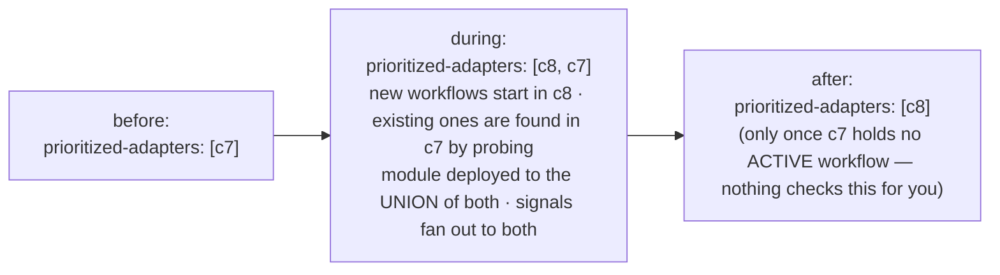

### Awareness contract (`WorkflowAwareness`)

Asking a BPMS whether it knows a workflow or task has four possible answers
(`MigratableProcessService.awarenessOfTask(workflowAggregateId, taskId)` /
`awarenessOfWorkflow(aggregatePersistence, workflowAggregateId)`):

|       Value        |                            Meaning                            |        Migration adapter's reaction         |
|--------------------|---------------------------------------------------------------|---------------------------------------------|
| `ACTIVE`           | The BPMS knows the workflow/task and it is active             | Use this adapter                            |
| `COMPLETED`        | The BPMS knows the workflow/task but it was already completed | Use this adapter (operation comes too late) |
| `UNKNOWN_TO_BPMS`  | The BPMS definitely does not know the workflow/task           | Fall back to the next adapter of the list   |
| `BPMS_UNAVAILABLE` | The BPMS could not be asked (unreachable, timeout)            | Do **not** fall back — retry later          |

The distinction between `UNKNOWN_TO_BPMS` and `BPMS_UNAVAILABLE` is crucial: only a
definite "not known" permits falling back to the next adapter — a temporary failure
must not silently elect the wrong BPMS. There is an instance-level method
(`awarenessOfWorkflow`) in addition to the task-level one because message correlation
has no task ID and task IDs are not unique across BPMSs. `WorkflowLocatorTest` walks the
four answers one at a time (`activeStopsTheWalk`, `unknownFallsThrough`,
`completedIsReported`, `unavailableNeverFallsBack`), so a fall-back sneaked into the
unavailable branch turns the build red.

The election runtime lives in `WorkflowLocator` (one instance per process service):
every operation on an EXISTING workflow (complete/cancel task, user task, message
correlation — in phase one and again at phase-two dispatch) walks the prioritized
adapters with an operation-specific probe (`awarenessOfTask`,
`awarenessOfUserTask`, `awarenessOfWorkflow`). `ACTIVE` executes there, `UNKNOWN_TO_BPMS`
falls through to the next adapter, `COMPLETED` is a warned no-op, and
`BPMS_UNAVAILABLE` fails naming the adapter — it NEVER falls back. New workflows always
start in the first-priority adapter (no probing).

The walk itself is drawn below. A cached hint is probed first and the remaining adapters follow in
list order, and each of the four answers ends the walk in its own way.

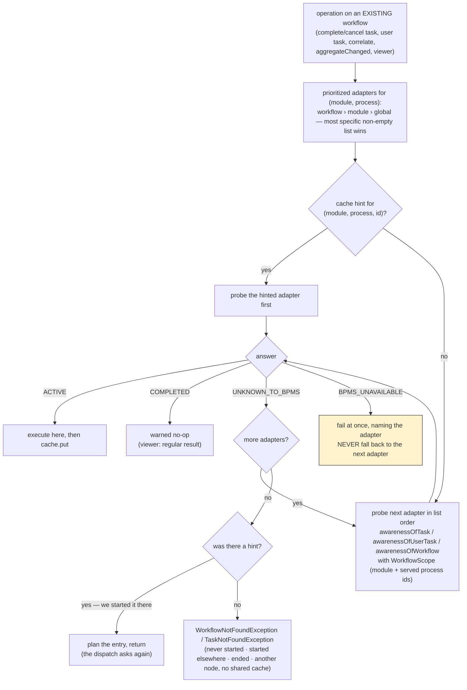

How long the walk may take is the CALLER's decision (`WorkflowLocator.Patience`), because
the same walk runs in places whose cost is not comparable. In **phase one** it runs
inside the application's transaction, holding a database connection and the locks on the
workflow aggregate: it asks every adapter once and never sleeps. At **dispatch** time no
application transaction is open, so an unreachable BPMS is worth two more questions
(500&nbsp;ms apart, fixed — "optimize late") and a read model which has not caught up is
worth its window. A **read** of the viewer/history API waits for the same window, for the
opposite reason: there is no outbox entry behind it which could ask again later, so what
it does not wait for becomes an error in the application. Decision 27 says why the split
is drawn there. The three patiences are held by
`WorkflowLocatorTest#withoutPatienceAHintedAdapterIsAskedOnce`,
`#withoutPatienceAnUnavailableBpmsFailsAtOnce` and
`#retryingPatienceDoesNotWaitForVisibility`.

At the dispatch the same walk gains the loop the phase-one walk must not have, for a BPMS which
cannot be reached. A workflow which is not visible yet gets no loop at all: the entry goes back to
the store, due in the window, because this thread dispatches the entries of every other workflow
too. Where the first picture ends in an exception, this one ends in an entry which is repeated and
finally blocked.

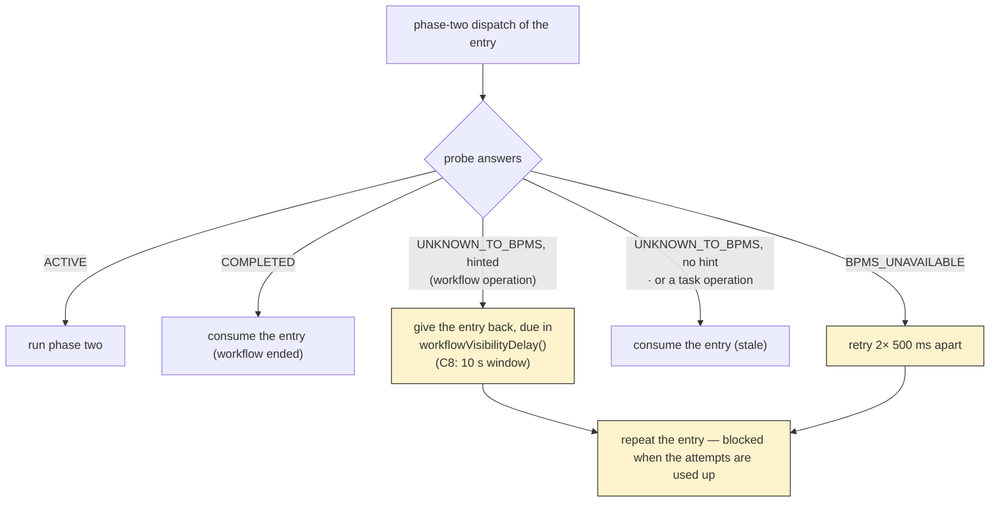

An adapter which cannot ask its BPMS at all says so (`canLocateWorkflows()`, `default true`)
and the core refuses to boot a workflow module which prioritizes it next to another
adapter: such an adapter answers optimistically, the walk stops at the first `ACTIVE`, and
the operations of every adapter behind it in the list would end up in the wrong BPMS. The
check runs once the adapters deployed - Camunda 8 learns from its first failed query
whether the cluster has secondary storage - and before anything touches a workflow. An
application which wants that routing anyway sets
`vanillabp.election.guessing-adapters: ACCEPTED` (per module:
`vanillabp.workflow-modules.<id>.election.guessing-adapters`) and keeps the message as a
WARN. `GuessingAdapterStartupTest` boots such a pairing and expects the refusal on both
platforms, `AcceptedGuessingAdapterStartupTest` the accepted variant.

What the walk cannot do is check the answers, and the SPI is where that duty is
written down: an adapter answers ONLY for the workflows and tasks of the scope it is
asked about, everything else is `UNKNOWN_TO_BPMS`. Every probe is handed that scope as a
`WorkflowScope` — the workflow module and the BPMN processes the calling process service
serves, secondary ones included, which the platform
integrations collect when they register the process services
(`MigrationProcessService.setServedBpmnProcessIds`). Before that a probe knew only the
workflow-aggregate ID, and neither it nor a task ID says whose workflow it is: two
adapter ids may address one backend (the migration from one scoping to another) and
two workflow modules of one backend may carry the same aggregate ID. Only the adapter
can compare the scope, which is why the contract sits in `MigratableProcessService`,
and `ElectionScopeContractTest` holds three halves of it: the walk reaching the holder
where the answers are scoped, stopping at the wrong adapter where one claims more than
it holds, and not claiming a workflow of another workflow module of the same adapter.
The shared-cluster setups of Camunda 8 and Camunda 7 are what happens without it.

Successful elections populate a `WorkflowAdapterCache`
(integration SPI; key = workflow module, BPMN process, serialized aggregate ID →
adapter ID). The next election probes the cached adapter first. Entries are HINTS,
not truth: a stale hit (the adapter answers `UNKNOWN_TO_BPMS`) falls through to the
full walk and repairs the entry; `BPMS_UNAVAILABLE` on a cached adapter follows the
retry-never-fallback contract. The platform integrations provide a bounded,
expiring in-memory default (`InMemoryWorkflowAdapterCache`, 10&nbsp;000 entries /
1&nbsp;h TTL by default, both configurable — see below); an application bean
implementing `WorkflowAdapterCache` replaces it, which is how a cluster shares its
elections. For Hazelcast that bean is shipped, in
[hazelcast-shared-election-cache](https://github.com/vanillabp/hazelcast-shared-election-cache),
where the nodes of the application form the cluster themselves; on any other cache
infrastructure the application writes the bean, which is the case this SPI was written
for. What a hint is worth is held by
`WorkflowLocatorTest#staleCacheHitIsRepaired` and
`#unavailableCachedAdapterNeverFallsThrough`, the bounded default by
`InMemoryWorkflowAdapterCacheTest`, and the replacement by an application bean by
`MigrationElectionTest#applicationProvidedCacheReplacesTheDefault`.

### An ended workflow lets go of its hint

The end of a workflow used to be an inbound delivery like any other, so it REFRESHED the
hint of a workflow which had just become uninteresting, and the entry then waited out a
full time-to-live in a cache a cluster pays for. The end now MARKS the hint instead
(`WorkflowAdapterCache.putEnded`, `WorkflowLocator.rememberWorkflowEnded`), and so does a
probe which answers `COMPLETED`.

A mark is not a deletion, and that is the point. What still arrives after a workflow
ended is a `completeTask` which lost its race with a timeout, a message correlated by an
endpoint which did not learn about the end, an outbox entry dispatched behind it and a
read of the viewer API. With the hint each of them asks the adapter which held the
workflow, hears `COMPLETED` and becomes a warned no-op; without it the full walk runs and
ends in a `WorkflowNotFoundException` as soon as the BPMS has forgotten the instance,
which is a matter of Camunda 7's `history-time-to-live` respectively how long Camunda 8's
secondary storage keeps a finished process. What the mark changes is the lifetime:
`vanillabp.workflow-adapter-cache.ended-time-to-live` (five minutes) against
`.time-to-live` (one hour), validated against each other at startup
(`WorkflowAdapterCachePropertiesTest#endedTimeToLiveHasToBeShorter`).

The key is workflow module, BPMN process and aggregate ID and does not name the instance,
so a second workflow on the same aggregate writes the same entry. Order therefore matters
and is handled where the entry is written: a mark leaves an entry naming ANOTHER adapter
alone, because only the election of that second workflow can have written it. Two
workflows on the same aggregate in the SAME adapter are indistinguishable by the key, so a
late mark shortens the fresh hint - one walk, never a wrong route.

`vanillabp.workflow-adapter-cache.release-on-workflow-end` (default `false`) is what makes
the notification arrive at all. VanillaBP has a BPMS report the end of a workflow only
where somebody asked for it, so this is the third consumer of that one signal next to a
`@WorkflowEnded` method and `vanillabp.delivery.release-on-workflow-end`, and switching it
on attaches a listener respectively a worker to every deployed process of the module.
Where one of the other two asked already, the cache is served at no extra cost. It stays
best effort: the Process-Engine-API reports no end at all and Camunda 8 reports `COMPLETED`
and never `TERMINATED`, so the lifetime remains the backstop rather than the exception.

An application's own cache decides for itself: `putEnded` is a `default` method falling
back to `put`, so a cache written before this existed compiles and behaves exactly as it
did. A cache which wants the saving implements the method and gives such an entry a
lifetime of its own (Redis: an `EX` of its own; Hazelcast: a per-entry `ttl`).

What holds all of this: `WorkflowLocatorTest#theEndMarksTheHint` and its two
`completed*MarksTheEntry` siblings for the marking, `#aCacheWithoutTheMarkKeepsWorking` for
the `default` method, `InMemoryWorkflowAdapterCacheTest#endedEntriesExpireEarlier` and
`#aSecondWorkflowOnTheSameAggregateWins` for the two lifetimes and the shared key, and
`WorkflowEndedTest#theCacheReleaseAsksForTheEndNotification` for the switch which makes the
notification arrive at all.

### Sizing the election cache, and knowing when to

Both bounds are properties of the platform, not of an adapter:
`vanillabp.workflow-adapter-cache.max-entries` and `.time-to-live`
(`WorkflowAdapterCacheProperties`, validated at startup like everything else, today's
values as defaults). An application running several thousand workflows of one process
at the same time does not run out of memory — the map is bounded, a full cache costs
about 3&nbsp;MB. It runs into EVICTION PRESSURE instead: more hot workflows than
places, so entries are dropped before they are read.

**Why the bound is a number and not a soft reference.** Soft references were
considered and rejected: the JVM clears them only when it is nearly out of heap, so
the cache would grow into the old generation and be reclaimed exactly when the
application is under pressure anyway; every soft reference is visited by full GCs,
which lengthens the pauses this kind of application cares about most; it would trade a
deterministic bound for one depending on GC tuning
(`-XX:SoftRefLRUPolicyMSPerMB`), for a cache whose loss is cheap by design; and the
numbers do not call for it, since 100.000 entries are roughly 30&nbsp;MB and raising
the bound is the cheaper answer. Both memory figures are estimates from the size of one
entry rather than something measured, and a heap dump of an application running a full
cache is what would correct them. An application which really wants soft or off-heap
semantics has the SPI bean for it.

**What is measured, and who owns which number.** There are two sets of them, and the
split is deliberate.

`WorkflowAdapterCacheStatistics` (one per application) counts what the ELECTION asked:
hits, misses, and how often the end of a workflow was marked. The process services wrap
WHATEVER cache is in use into an `InstrumentedWorkflowAdapterCache` reporting there, so
these three exist for the in-memory default, for the shared cache VanillaBP ships for
Hazelcast and for a cache an application wrote itself. A number which disappears once
somebody plugs in their own cache would surprise exactly the operator who needs it. They
are published under `vanillabp.workflow.adapter.cache.*` by `WorkflowAdapterCacheMeters`.

What an implementation knows about ITSELF belongs to that implementation and is published
under a prefix which says which one it is. The in-memory default owns an
`InMemoryWorkflowAdapterCacheStatistics` (created in its constructor, written by nobody
else) with its size, the size of the marks it holds, its evictions, the evictions before
an entry was ever read and the LOST HINTS;
`InMemoryWorkflowAdapterCacheMeters` publishes them under
`vanillabp.inmemory.election.cache.*` and registers NOTHING where the cache in use is
another one. That is the point: a size which cannot be read is a meter which is absent
rather than one reporting NaN forever, and an eviction counter which can never leave zero
(the Hazelcast cache has no size bound at all) is not published either. A cache which
lives somewhere else reports what it knows the same way, under a prefix of its own.

The size of the marks is what tells an operator whether the release works, since it rises
while workflows end and falls again as the shorter lifetime takes those entries away.
Micrometer is OPTIONAL for all of it, and both platforms apply `MeterBinder` beans to
their registries by themselves, so an application without it boots unchanged and reports
nothing.

**The warning is about lost hints, not about a full cache.** A cache which is merely
full is healthy, and an entry evicted unread is not by itself a defect (a workflow
which is started and never operated on afterwards leaves exactly such an entry
behind). It becomes one when that workflow IS looked up later: then the bound, not the
workflow, decided the outcome. The keys of unused evictions are therefore remembered
(hash codes, bounded like the cache), and a later miss on such a key is a lost hint.
Ten of them within an hour produce ONE guiding WARN naming the observed number, the
observation period and the property to raise. Heap pressure is deliberately not the
trigger, because the cache cannot see the old generation and the JVM does not tell it.
`InMemoryWorkflowAdapterCacheStatisticsTest` holds the counting and the rule the warning
follows: `lookupOfAnEvictedEntryIsALostHint`,
`onlyUnusedEvictionsCountTowardsThePressure` and
`evictionPressureIsWarnedAboutOncePerHour`. That the numbers of the election hold for
every cache is `WorkflowAdapterCacheStatisticsTest#theElectionsNumbersHoldForEveryCache`,
and that no meter of the in-memory cache exists while another cache is in use is
`WorkflowAdapterCacheMetersTest#aForeignCachePublishesNothingItCannotKnow`.

The lost hint is detected by the cache rather than by the decorator around it, because
only the cache knows that this key was one it dropped. The miss itself is still counted
where every miss is counted.

The workflow probe takes the aggregate's persistence because a BPMS without a business
key finds the workflow by the process variable carrying the aggregate's ID, and that
variable is named after the aggregate's ID attribute
(`AggregatePersistenceAware.getAggregateIdName()`). The election runs BEFORE every other
SPI method of an operation, so an adapter must never derive the name from a previous
call - Camunda 8 did exactly that once and searched under a placeholder name,
which found nothing on a cluster with secondary storage and reported every workflow as
unknown.

To migrate, one puts the new BPMS first in the priority list and keeps the old one in
the list: new instances start in the new BPMS while existing instances complete in the
old one.

### Waiting for a workflow to become visible

An election which asks a BPMS answering from an eventually consistent read model
(Camunda 8 searches its query API, fed by an exporter) gets an honest "unknown" for a
workflow started moments ago. Turning that into `WorkflowNotFoundException` names causes
which are all wrong, and it hits the most ordinary sequence there is: start a workflow,
then correlate the message which lets it continue.

Four pieces solve it, and the split matters:

1. **The adapter contributes the window, the core does the waiting.**
   `MigratableProcessService.workflowVisibilityDelay()` (a `default` returning
   `WorkflowVisibilityDelay.none()`, so no adapter breaks) answers how long an
   `UNKNOWN_TO_BPMS` may still turn into `ACTIVE` and how often to ask. Camunda 7 answers
   from the very transaction which created the instance and reports none; Camunda 8
   reports `vanillabp.adapters.<id>.workflow-visibility-timeout` (default 10 seconds,
   zero switches it off). Eventual consistency is the core's business, the timing is the
   adapter's.
2. **The waiting is bounded by a hint, never blanket.** VanillaBP waits only for an
   adapter the `WorkflowAdapterCache` names for that workflow. A workflow nobody ever
   heard of has no hint and fails immediately - which a wrong ID has to, since waiting
   the full window on every typo would turn a programming error into a timeout.
3. **The cache is filled where VanillaBP knows the answer without asking**
   (`MigrationProcessService.rememberWorkflowAdapter`): when a start is SCHEDULED (the
   elected adapter is decided then), again after its phase two, and on every inbound
   delivery - a task, a user task, a BPMS-initiated start. The end of a workflow is the
   one delivery which marks the hint instead of refreshing it (see above). For the latter the inbound contexts carry the adapter's id
   (`TaskInvocationContext.getAdapterId()` and its siblings, `default null`, implemented
   by all three adapters). A delivery PROVES which BPMS holds the workflow.

   Recording at SCHEDULING time is what makes the sequence work at all: on a remote BPMS
   the instance is created after the commit, so a correlation in the very next
   transaction runs its election before phase two ever ran. Without the early hint it
   would find nothing to expect. The price is the usual one of a hint: a rolled-back start
   leaves an entry behind, and the next operation on that aggregate ID is planned and
   dispatched until the outbox blocks it, instead of failing at the call.

4. **The waiting happens at the dispatch and in a read, never in the caller's
   transaction.** Phase one asks once. Where the answer is "unknown" although a hint says
   the workflow exists, the operation is PLANNED - the aggregate is saved, the outbox entry is written, the caller
   returns - and the dispatch asks again and hands the entry back, due in the window, while
   the BPMS still says nothing. In everyday operation (Camunda 8 lags one to three
   seconds) that costs an attempt and nobody an error; while an exporter is broken it
   costs attempts until the entry is blocked, which is where it becomes visible. Where the
   work hangs on a JOB - a `@WorkflowTask`, an asynchronous task whose completion does not
   arrive - the cluster runs out of job retries and Camunda raises an incident of its own;
   where no job is behind it (a correlation from a REST endpoint), the blocked entry and
   its counter are that place. Decision 27 carries this, including what it costs.

   A read of the viewer/history API (`getProcessDefinitions`, `getWorkflowHistory`) is the
   one caller which waits for itself. It has no phase two to plan and nothing repeats it
   later, so it waits where a hint says which adapter holds the workflow. Asking for the
   history of a workflow the application started seconds ago is what a viewer does all day,
   and the seconds Camunda 8's exporter lags behind must not answer it with
   `WorkflowNotFoundException`. Without a hint the read still fails at once, and a hint
   which never comes true costs the window before the failure names the adapter which was
   expected to answer.

**What was deliberately NOT built: an outbox query.** A `START_WORKFLOW` entry still
`OPEN` would prove "too early rather than unknown", and one `DONE` a moment ago would
prove "exactly the window we are waiting for". It was left out:

- the outbox can only ever contribute the POSITIVE half. A workflow does not have to have
  been started by this VanillaBP: a version-1 application which migrated, a start by
  another system, a BPMS-initiated start (which writes no entry at all) and a cleaned-up
  `DONE` entry all leave the outbox silent while the workflow runs perfectly well;
- it would need a new query method in EVERY store implementation (gruelbox, the Spring
  and Quarkus JDBC stores, MongoDB, and any store an application wrote itself) - the SPI
  `PhaseTwoOutbox` has exactly one method today, `schedule`;
- what it would buy over the cache is one case: the start ran on ANOTHER node of a
  cluster, whose in-memory cache the correlating node does not share. That case is the
  one the `WorkflowAdapterCache` bean exists for - an application running clustered
  plugs its shared cache in, which is cheaper than teaching every outbox store a query.

The residual is therefore honest and documented: on a cluster WITHOUT a shared cache, an
operation reaching a node which neither started the workflow nor received a delivery for
it has no hint, so it fails at the call while the BPMS catches up. Retrying the business
operation works, and so does a shared cache - which is what the
`WorkflowNotFoundException` says when an eventually consistent adapter is configured.

The other residual is the mirror image: an operation with a hint whose workflow really is
gone (ended long ago and cleaned out of the read model) is planned instead of refused. Its
entry is repeated and finally blocked, and the counter of blocked entries is where it
shows. That is the price of never refusing an operation on a workflow which merely is not
searchable yet.

Correlating a message is the operation on which both patiences show up in one call, and the
picture follows such a call from the caller's transaction to the BPMS: phase one asks the adapters
once and lets the caller commit, the dispatch asks again and publishes the message as soon as
the BPMS reports the workflow, which may take an entry or two.

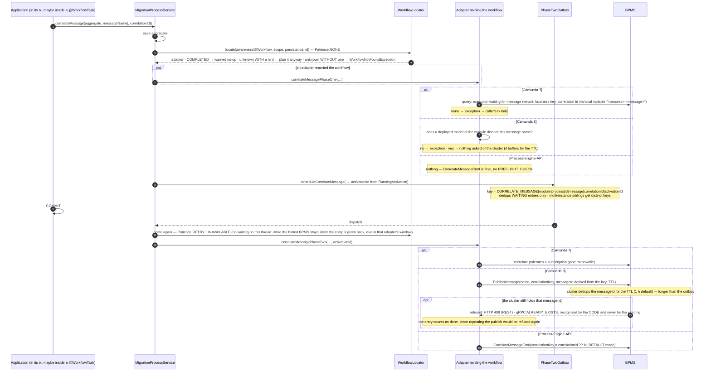

Starting a workflow by a message follows the same shape and derives the plain start's idempotency
key, so a workflow is started at most once per aggregate whichever of the two calls did it.

`WorkflowVisibilityDelayTest` runs the ordinary sequence on both platforms
(`correlationIsPlannedAndDispatchedWhenTheWorkflowShowsUp`, `unknownWorkflowStillFailsFast`),
`WorkflowLocatorTest#withoutAHintAnUnknownWorkflowIsNotExpected` and
`#hintedAdapterIsAskedAgainWithinItsVisibilityWindow` hold the two halves of the hint rule,
and the read path is `ViewerApiTest#readWaitsForAnEventuallyConsistentAdapterToCatchUp`
together with `#readFailsAfterTheVisibilityWindowPassed`.

### Deployment pipeline

`DeploymentService` orchestrates deployment per workflow module:

1. Resolve the adapters the module has to be deployed to and find the matching
   `AdapterDeploymentService` by adapter ID. This is the **union** of the module's
   effective prioritized-adapters list and every adapter named in a workflow-level
   `prioritized-adapters` override of that module: BPMS election is
   process-granular while deployment is file-granular, so an adapter prioritized
   for a single workflow only still has to receive the module's resources —
   otherwise starting that workflow would fail at runtime. Every adapter of the
   union receives the module's *full* resources (per-process filtering was
   considered and rejected: BPMN files may contain several processes and adapters
   deploy whole files; extra processes deployed to an adapter are inert because
   workflow starts are routed by the election, and during a BPMS migration having
   the module's complete model in both BPMS is even desirable).
2. Load the BPMN resources (either from an adapter-specific `resources-location` or
   the generic VanillaBP BPMN files). The loader is asked per file extension, so the
   same location answers for `.bpmn` and for `.dmn`.
3. For each file run the pipeline `readBpmn` → `prepareBpmn` (per process) →
   `wireBpmn` (adapter) → `wireBpmn` of all matching `ExtensionWiringService`s.
   The adapter-specific *processing context* (generic parameter `PC`) is accumulated
   across all executable processes of a file and across all files of a module.
   Extensions receive the same processing context as the adapter's `wireBpmn`;
   extensions are matched by assignability, so extensions may declare interfaces
   as model or processing-context type.
4. Read the module's `.dmn` files into the same processing context (`readDmn`), after
   its processes: a decision a business rule task calls belongs to the module and is
   deployed with it, and the context it is added to is what reading a process produced.
   A module without an executable process is skipped as before — and the warning says
   that its decision tables are not deployed either, because a decision travels with the
   processes calling it and never on its own. The SPI method is a `default` which takes
   no file and says so once per file, so an adapter written before this existed keeps
   working and an application is told rather than left with a business rule task nobody
   deployed anything for.
5. `deployResources` pushes the result to the BPMS. A failing deployment aborts
   booting unless the adapter's `deployment-failure` policy is `warn` *and* the
   adapter is first priority neither for the module nor for any of its workflows.
   After all adapters were processed, configured workflow IDs
   (`vanillabp.workflow-modules.<module>.workflows.<id>`) matching no executable
   BPMN process found are reported by a WARN naming the known process IDs (not a
   failure — the BPMN may arrive later, e.g. during a BPMS migration; process IDs
   are known only after `readBpmn`, which is why this check lives in the pipeline
   and not in the early properties validation).
6. Once the application is ready, `startWorkflowProcessing` is called for adapters and
   extensions — only then workflows are actually processed. It is called for *every*
   adapter resources were deployed to (not only the highest-priority one), since
   during a BPMS migration all configured BPMSs have to keep processing workflows.
7. On graceful shutdown of the application, `stopWorkflowProcessing` is the
   counterpart of step 6, executed in reverse order: extensions are stopped first (in
   reverse wiring order), then the adapters. It is wired by the platform integrations
   (Spring Boot: `SmartLifecycle.stop()`; Quarkus: a `ShutdownEvent` observer) so no
   new workflow jobs are processed while web/messaging infrastructure is being torn
   down.

The pipeline is a protocol rather than a set of calls, which is what the picture shows: the order
the core calls an adapter in, and the points at which the adapter calls back into the core
while it reads a file.

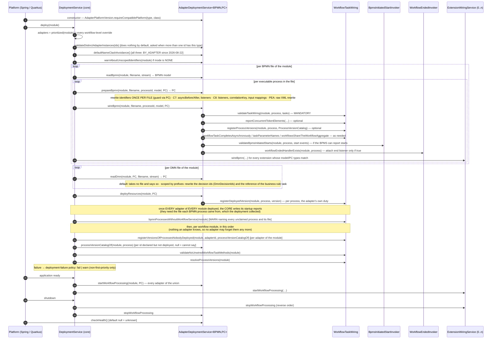

`DeploymentServiceTest` holds the pipeline itself, the deployment union of a
workflow-level override included (`workflowLevelAdapterIsIncludedInDeploymentUnion`), the
WARN about a configured workflow id no BPMN process matches
(`unknownConfiguredWorkflowIdIsWarned`) and the reverse shutdown order
(`extensionWiringServicesAreStoppedBeforeAdapters`). `DeploymentPipelineTest`,
`MultiAdapterDeploymentTest` and `ShutdownReverseOrderTest` run the same against a booted
application per platform.

### Name-clash avoidance (`NameClashAvoidanceSupport`)

One adapter-scoped property decides how a workflow module's identifiers are kept
apart from another module's: `name-clash-avoidance` = `BY_ADAPTER` (VanillaBP 1's
behavior — the BPMS' own isolation, e.g. a tenant named after the module) |
`USE_PREFIX` (no tenant; VanillaBP prefixes the identifiers, separator `__`) |
`NONE`. The core owns both the resolution (most-specific-wins across workflow >
workflow module > adapter) and the composition of the strings
(`NameClashAvoidanceService implements NameClashAvoidanceSupport`, handed to every
adapter as a platform bean).

Without any configuration the ADAPTER's default applies
(`AdapterDeploymentService#defaultNameClashAvoidance`, `BY_ADAPTER` unless
overridden). No shipped adapter overrides it: all three answer `BY_ADAPTER` since
2026-08-22 (`UPGRADE.md`, "name-clash-avoidance is `by-adapter` again"), because that
is what VanillaBP 1 deployed and an upgraded application has to find its workflows in
their tenants. Both Camunda adapters answered `NONE` for eleven days, which is what a
Camunda 8 cluster from the stock image needs - it has multi-tenancy switched off and
rejects a deploy command carrying a tenant id - and that case is answered by a guiding
boot failure naming `use-prefix` and `none` rather than by a different default. The platform integrations
hand the adapters' deployment services to the service as a lazily resolved supplier
(adapters receive the service themselves, so they cannot be injected).

`BY_ADAPTER` means "the BPMS' own isolation", and what that IS the core does not know
(a tenant, a namespace, a database of its own). It therefore computes none of it: the
adapters derive the tenant themselves from the resolved mode (`Camunda8Scoping` and
`Camunda7Scoping`, duplicated on purpose - the rule is one line and the concept is
theirs). The core answers `modeFor` and nothing else.

The same split holds for validating: an adapter which carries configuration only
BY_ADAPTER could honor hands the PROPERTY KEY to `validateNoneNameClashStrategy`, and
the core answers whether BY_ADAPTER applies anywhere for that adapter - if it does
not, the boot fails naming the property, the modes which do apply and the two ways to
reconcile them. Both Camunda adapters pass their `tenant-id` this way.

And for asking the BPMS itself: Camunda 8 looks the tenant up in the cluster before
deploying (a cluster without multi-tenancy, or an unknown tenant, becomes a message
naming the property to change), while Camunda 7 has nothing to ask - a tenant id is an
attribute of the deployment there and the engine creates nothing.

Since `NONE` protects nothing, the core has the ADAPTER report it once per workflow
module and adapter id while the mode is resolved, i.e. at startup
(`AdapterDeploymentService#warnAboutUnscopedIdentifiers`). What can be used instead
is BPMS knowledge: Camunda 8 offers prefixing, a tenant per module on a
multi-tenancy cluster or a cluster per module, Camunda 7 offers prefixing, a tenant
per module or an engine per module (`data-source-name`, `table-prefix`). The default
implementation names what every BPMS can offer.

An adapter only decides WHERE to apply the result:

- in `prepareBpmn`, on its own model type — only the adapter knows it. Note the
  pipeline calls `prepareBpmn` once per PROCESS while all processes of a file share
  ONE model, so a model must be rewritten **once per file** (the adapters guard this
  by checking whether the file is already in the processing context);
- at every runtime boundary, outbound (`scoped*`) and inbound (`plain*`). Inbound
  always strips a KNOWN prefix, never "everything up to the first separator".

The result is transparent: registries, `ProcessService` calls, BPMN files and
configuration keep the PLAIN identifiers; only the BPMS sees scoped ones. Which
identifiers actually need scoping is BPMS-specific and documented in each adapter's
wiki (Camunda 7 does not prefix task definitions — they are process-local
expressions; Camunda 8 must prefix job types — they are subscribed cluster-wide).

Two guardrails belong to adapters:
`validateNativeIsolationSupported(adapterId, workflowModuleId, bpmsDescription)` is
called while DEPLOYING by an adapter whose BPMS has no isolation of its own (it
rejects `BY_ADAPTER`; `validateDistinctAdapterInstances` is the wrong place, the core
invokes that only for more than one id of a type), and
`validateNoCollidingProcessIds(adapterId, deployedProcesses)` is called once the
deployed processes are known. Changing the mode is a BPMS **migration**, not a
property change — hence a differing mode makes two adapter ids of one type distinct.

`NameClashAvoidanceServiceTest` goes through all of it: the resolution and the composition
(`mostSpecificLevelWins`, `prefixComposesIdentifiers`, `readingBackStripsKnownPrefixOnly`),
the adapter default (`defaultsToByAdapter`) and both guardrails
(`byAdapterIsRejectedWithoutNativeIsolation`, `collidingProcessIdsAreReported`).

### Workflow-task processing

`@WorkflowTask` methods are executed by the core (package `workflowtask`): the
platform integration registers every `@WorkflowService` class under all BPMN
process IDs it declares (`bpmnProcess` + `secondaryBpmnProcesses`) with the
`WorkflowTaskRegistry` (scanning methods and building parameter binders once at
startup). Adapters interact through two adapter SPIs which the registry implements
together - `WorkflowTaskWiring` while an adapter deploys, `WorkflowTaskInvoker` in its
worker threads.

What counts as such a class is checked before anything is registered. An interface carrying
`@WorkflowService`, and an annotation of the application composing it, are refused - by Spring Boot
while the application starts, by Quarkus while it is built - and
`WorkflowServiceBelongsOnAClass` is the message both platforms say it with. VanillaBP reads the
`@WorkflowTask` methods off the annotated type, and Java inherits a method annotation from a
superclass and not from an interface, so the platforms would not even read the same methods: Spring
Boot sees the bean's class, Quarkus the interface its index reports. A subclass of an annotated
class stays a workflow service, which is what `@Inherited` promises and what a declaration shared
by several classes uses: the class handed to the registry is that SUBCLASS on both platforms, so
its methods, its BPMN process id and its workflow module are the ones in play (see decision 32 in
the repository's DECISIONS.md).

Two ways of writing a handler method are reported instead of served, and
`HandlerMethodsNobodySees` builds that report, once per workflow service class, from here so both
platforms write the same one. A `@WorkflowTask`, `@WorkflowStartedByBpms` or `@WorkflowEnded`
method which is not public is not among the methods the scanners read, and an override which
repeated none of the annotations replaced the annotated method with one carrying nothing, because
Java never inherits a method annotation. Both look to the developer like a handler which is right
there in their source, and both used to arrive as the wiring validation asking for a method that
exists. It is a WARN rather than the end of the boot, since an application whose model carries the
task ends its boot anyway, on the message about that task, and this is the sentence saying why the
method was not found. Serving such a method by reflection was refused: from the moment VanillaBP
lifts the visibility of a handler, which methods a class offers stops being the decision of
whoever wrote the class.

They were one interface of thirty methods until it became clear that a
mandatory call an adapter can forget will be forgotten: Camunda 7 forgot the reverse
wiring check for a year, and a typo in a task definition stayed silent until a workflow
reached the task.

1. During `wireBpmn`, through `WorkflowTaskWiring`: `validateTaskWiring(module, process,
   tasks)` reports every BPMN task without a `@WorkflowTask` method, all defects in ONE
   guiding exception; throwing from `wireBpmn` honors the deployment-failure policy. The
   other wiring calls answer what the adapter needs about the model: which parameters a
   delivery has to carry, whether a task may stay open, which processes share an
   aggregate, which elements can put a second token into a workflow.

   A process NO `@WorkflowService` class claims is the one case that call does not
   validate. A BPMN file goes to the BPMS as a whole, so a process modelled next to the
   one the application asked for is deployed with it, and the file may well belong to
   somebody else: a called process a modeller drew alongside the calling one, or a
   process which moved out of the application while its model stayed. Asking such a
   process for `@WorkflowTask` methods ended the boot over a model the application cannot
   change, and the message it wrote - add a workflow service for this process - is the
   right sentence only where the application means to serve it. The registry collects the
   process instead, and the deployment reports the module's unclaimed processes in one
   WARN naming each process, its file and what it costs. Where a service DOES claim the
   process, nothing changed: an unmatched task ends the boot as before, because that is a
   defect the developer can fix in their own code.

   **What the core does on its own**, once the last adapter of a workflow module finished
   deploying: four calls on `WorkflowTaskWiring`, of which three run per module. The
   report about the processes no `@WorkflowService` class claims comes first, from
   `bpmnProcessesWithoutWorkflowService(module)`, and it is written with the deployment's
   other startup reports rather than inside the per-module checks, because those reports
   name the file each BPMN process came from and that map belongs to the deployment as a
   whole.

   The three per-module calls follow, in an order which matters. Every adapter of the
   module is asked first, through
   `registerVersionsOfProcessesNobodyDeployed(module, adapter, ...)` and the adapter's
   `processVersionCatalogOf`, what its BPMS still holds for a BPMN process the
   application declares without bringing a model - the id a rename left behind. Those
   versions have to be in before `validateNoUnwiredWorkflowTaskMethods(module)`, the
   other direction of the wiring check where every method has to match a task somewhere
   in the module: without them a method kept for a renamed process reads exactly like a
   method wired to nothing. `resolveProcessVersions(module)` goes last, because a method
   serving no task at all is the more basic defect and the developer should read about it
   first.

   All four need nothing an adapter knows, so the core picks the moment instead of asking
   every adapter author to remember it. The reverse check stays exactly as loud as it
   was: an unclaimed process is never compared against methods, so it can neither excuse
   nor hide one.
   `registerDeployedVersion` stays with the adapter: only it knows which version its BPMS
   ended up with.

2. At runtime: `invokeWorkflowTask(module, process, TaskInvocationContext)` - the
   core resolves the handler (task definition or activity ID, `version` ranges),
   loads the aggregate by its serialized ID, invokes the method with bound
   parameters and saves the aggregate, all within one transaction run by the
   platform's `TransactionRunner` (a new transaction, or the caller's for embedded
   BPMS - `TaskInvocationContext.runInCurrentTransaction`). Outcomes: normal
   return = COMPLETED (or COMPLETION_PENDING for `@TaskId` methods - completion
   arrives via `ProcessService#completeTask`); `TaskException` = BPMN_ERROR with
   the aggregate changes COMMITTED (the restored V1 contract); any other exception
   rolls back and propagates - the adapter applies its BPMS' retry semantics and
   must not complete the task.

One delivery of one task runs through the core as the picture shows: the delivery log is read
before the aggregate is loaded, the handler runs inside the one transaction together with the
aggregate and the record, and the answer to the BPMS follows that commit on a remote BPMS while
Camunda 7 gives it inside the engine's own transaction.

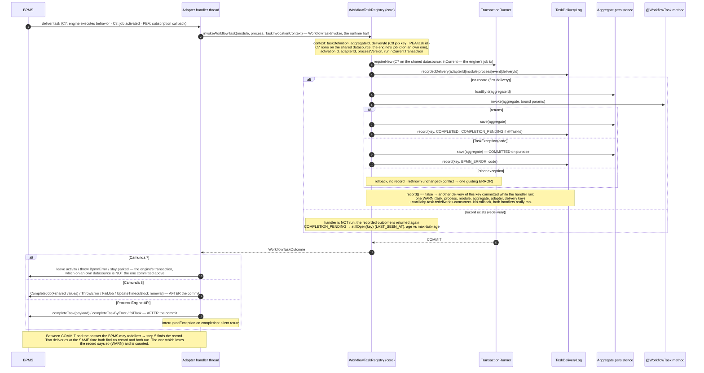

`WorkflowTaskRegistryTest` holds the wiring calls and the outcomes one by one
(`validateTaskWiring`, `validateNoUnwiredWorkflowTaskMethods`,
`taskExceptionYieldsBpmnErrorAndCommits`, `otherExceptionPropagatesWithoutSaving`), and
`WorkflowTaskProcessingTest#taskProcessingCoversAllOutcomesAndBindings` runs the same
outcomes through a booted application on both platforms.

What an adapter hands the core is a bag of getters per delivery, and the picture lists the three
of them next to the invoker interfaces which receive them: a task delivery, a workflow the BPMS
started by itself and the end of a workflow.

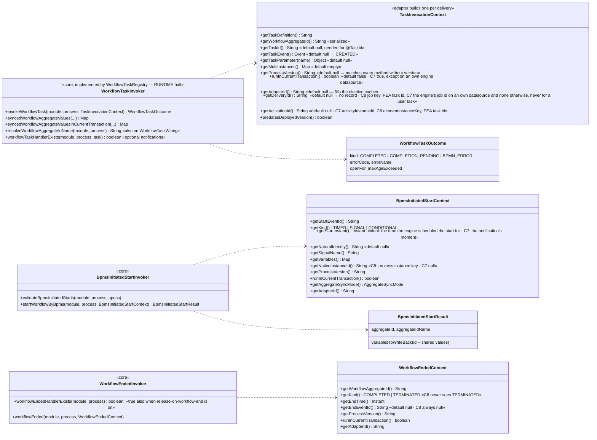

An adapter's `AdapterDeploymentService` extends `ExtensionWiringService`
("the wiring service with deployment"): preparing/wiring and starting/stopping of
workflow processing are inherited, reading and deploying of BPMS resources is added.
There is deliberately no DMN model type parameter yet — DMN support will be added to
the interface once designed.

#### Deployment-failure policy

By default, a failing deployment of any configured adapter aborts booting of the
application. During a BPMS migration the old BPMS may be temporarily unreachable —
setting `vanillabp.adapters.<id>.deployment-failure` to `warn` lets the application
start anyway if a NON-first-priority adapter fails to deploy (the failure is logged
and that adapter does not process workflows). A failure of the first-priority adapter
always fails the boot, regardless of the policy, because new workflows could not be
started otherwise. Both halves are held by
`DeploymentServiceTest#nonPrimaryAdapterFailureWithWarnPolicyBootsAnyway` and
`#primaryAdapterFailureFailsEvenWithWarnPolicy`, and per platform by
`DeploymentFailureWarnTest` and `DeploymentFailureFailTest`.

#### The variables a handler reads (`taskParameterNames`)

A `@TaskParam` takes what the BPMS GENERATED on this path through the model: the target of
an input or output mapping, the result of a script or a decision, a value the model
computed rather than the workflow aggregate holds. Most applications need none of it, and
it can never be ruled out, because a model may produce a value the application has to see.

Those names exist in exactly one place, and it is here. `WorkflowTaskScanner` reads them
off the annotations while it builds the parameter binders, `WorkflowTaskHandler` keeps them
and `WorkflowTaskRegistry#taskParameterNames(module, process, taskDefinitionOrActivityId)`
reports the union over every handler serving that element - a union, because methods
serving different process versions share one BPMN element and whichever of them runs has to
find its variable. The list is sorted and duplicate-free, which a subscription comparing
itself across restarts needs (a Camunda 8 job stream is equivalent to another one only when
the fetched variables match).

Why the core has to say it: at runtime an adapter pulls the values one name at a time
through `TaskInvocationContext#getTaskParameter(name)`, and by then the delivery has already
happened. A BPMS which ships a variable payload with every delivery has to know the names
BEFORE it subscribes, and the only other place it could look is the BPMN model - which is a
guess, since the model may declare names nobody reads and a handler may read a name no model
declares. Camunda 8 derived the list that way for a while; the model scan is gone rather
than kept as a second source for one answer.

The method is a `default` returning an empty collection, so an adapter which never heard of
it keeps the behaviour it had. BPMS-initiated starts deliberately have no counterpart: the
core copies EVERY variable such a start carries into the workflow aggregate it builds
(`BpmsInitiatedStartExecution#writeVariables`), so a start worker has to ask for all of them
regardless of what any `@TaskParam` names. The union and its order are held by
`WorkflowTaskRegistryTest#theUnionOfEveryMethodServingTheElement`,
`#theDeclaredNamesAreReported` and `#theDefaultAnswersNothing`.

#### Deliveries VanillaBP already processed (`TaskDeliveryLog` SPI)

The inbound counterpart of the outbox. A remote BPMS reports the outcome AFTER the
local transaction was committed, so a crash in between makes it deliver the same task
again - which used to run the `@WorkflowTask` method a second time. The core now
remembers a processed delivery and answers a repeated one from the record.

Everything about those records lives in `DeliveryRecords`, one per process service: it
resolves the store, keys a delivery, answers a repeated one, measures how long a task has
been open, and reads a record to tell which adapter holds a task. It takes the adapters as
a parameter where it needs them, the way `WorkflowLocator` does - which adapters serve a
BPMN process is the process service's business, not the records'.

- The identity of a delivery comes from the adapter:
  `TaskInvocationContext.getDeliveryId()` (Camunda 8: the job key; Process-Engine-API:
  the task ID; Camunda 7: none, see below). `TaskDeliveryKey` (package `workflowtask`)
  qualifies it with adapter ID, workflow module, BPMN process and event, so an ID only
  has to be unique within its own BPMS, and hashes the result where it would outgrow
  what a store can index (512 characters, MySQL's unique-key limit with utf8mb4).
- The record is written in the handler's own transaction
  (`MigrationProcessService.executeWorkflowTask`): read before the aggregate is loaded,
  written after it was saved, and it carries the OUTCOME (`WorkflowTaskOutcome.Kind`
  plus BPMN error code and name). A repeated delivery therefore reports the recorded
  outcome again - skipping both handler and answer would leave the task open forever.
  A handler which threw leaves no record: the rollback took it, and the BPMS' retry
  runs the handler again.
- Two deliveries of one task which OVERLAP are the case a record written after the work
  cannot catch: both read no record, both run the handler, and the second `record(...)`
  finds the key taken and returns `false`. Nothing is rolled back there, because both
  handlers really did their work. What the core does with that knowledge is say it out
  loud: `DeliveryRecords#reportHandlerRanTwiceAtTheSameTime` writes one WARN
  naming the task, the workflow, the adapter and the delivery key, and counts the case as
  `vanillabp.task.redeliveries.concurrent`, the counterpart of
  `vanillabp.task.redeliveries.deduplicated`. Both halves are held by
  `InboundIdempotencyTest#twoDeliveriesAtTheSameTimeAreNamedAndCounted`, on Spring Boot
  and on Quarkus.
- `TaskDeliveryLog` and `TaskDeliveryLogAware` live in the integration SPI next to
  `PhaseTwoOutbox`, with the same per-aggregate resolution
  (`TaskDeliveryLogResolver`, implemented per platform): a record has to ride the
  aggregate's own transaction. `JdbcTaskDeliveryStore` and
  `TaskDeliveryRetentionCleanup` (package `delivery`) hold the SQL respectively the
  cleanup schedule both platforms share; the connection comes from
  `JdbcConnectionAccess`, the one piece which cannot be platform-neutral. Whether a
  table is there is asked of the JDBC metadata by `jdbc.JdbcSchema#tableExists`, used
  by every store which either creates its table or verifies that the application
  created it - including the gruelbox outbox of the Spring Boot integration, whose
  table is gruelbox's and therefore not shipped by `vanillabp-schema`.
- The switch is the adapter-scoped `deduplicate-deliveries` (default `true`),
  resolvable per workflow module, workflow and task like every adapter-scoped key.
- An adapter says whether it needs this at all:
  `MigratableProcessService.deliversTasksAtLeastOnce()` (default `false`). It decides
  the startup report only - at runtime nothing is remembered where no delivery ID
  arrives. Camunda 7 answers `false` on purpose: it delivers tasks inside its own
  transaction, so a redelivery proves that nothing was committed.
- Without a store there is a guiding WARN at startup
  (`validateTaskDeliveryLogAtStartup`, once per process service) instead of a failed
  boot. Unlike the outbox, nothing is broken without a log - the behaviour is the one
  every VanillaBP had before, and the wiki's rule about idempotent handlers covers it.

Camunda 7 on an own engine datasource is the mode which makes a redelivery visible to the core at
all, and the picture shows why: the engine's job transaction is one the application's persistence
cannot join, so the record commits before the engine rolls its job back, and the job the engine
runs again is answered from the record without entering the `@WorkflowTask` method.

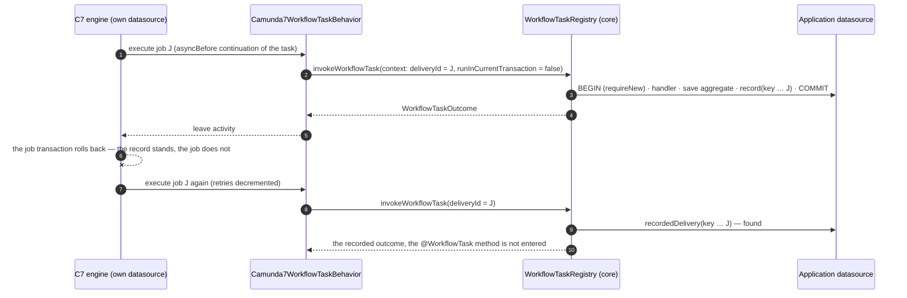

Two deliveries of that mode carry no identity at all, the notification about a user task and the
one about a cancelled task. Both travel with whatever job the engine happens to run, and one such
job creates respectively cancels every task the token reaches, so its id would name several
deliveries at once.

`InboundIdempotencyTest` holds the mechanism at both levels: in the core
(`repeatedDeliveryIsAnsweredFromTheRecord`, `aRolledBackDeliveryIsProcessedAgain`,
`deliveriesWithoutAnIdentityAreNotDeduplicated`, `aMissingDeliveryLogIsReportedAtStartup`)
and once per platform against a booted application. `TaskDeliveryKeyTest` holds the
qualification and the hashing.

#### The end of a workflow releases its records

Age alone is a poor answer to "how long does a record have to be kept": seven days are
too long for a busy application and too short for a task genuinely open longer than
that. The end of a workflow is the exact statement the retention only approximates,
since nothing of an ended instance can be redelivered.

- The switch is `vanillabp.delivery.release-on-workflow-end` (`DeliveryProperties`,
  resolved by `MigrationAdapterProperties.releasesDeliveryRecordsOnWorkflowEnd`), global
  and per workflow module, default `false`. It is adapter-INDEPENDENT: the records of
  every BPMS live in the store of the aggregate, so this is a question about the
  application's data.
- Off by default because the end of a workflow is reported only where it is used:
  adapters ask `WorkflowTaskRegistry.workflowEndedHandlerExists` while wiring, and that
  method answers `true` where the release is switched on, even without a
  `@WorkflowEnded` method. That is the whole reason no adapter had to change for this.
- The deletion runs in `WorkflowEndedHandlers.workflowEnded`, inside the transaction that
  notification opens anyway, bounded by workflow module, BPMN process, aggregate and by
  an `Instant` taken BEFORE the notification is processed. The time bound is what keeps
  the records of a SECOND workflow on the same aggregate, which is possible since
  aggregates outlive their workflows.
- `TaskDeliveryLog.releaseRecordsOf(...)` has a default deleting nothing, so every store
  written before this stays valid. Whether a store implements it is answered by
  reflection over the class the platform integration hands out
  (`TaskDeliveryLogResolver.storeClassOf`, which unwraps CDI client proxies respectively
  Spring AOP proxies - a proxy overrides the default method and would claim a release
  which does not exist). A store which cannot release plus the option switched on is one
  WARN at startup; with the option off nothing is logged.
- The retention stays for everything the end of a workflow does not cover: workflows
  still running, aggregates whose workflow never ends, stores without the release.

`DeliveryRecordReleaseTest` holds every one of those bullets, in the core and once per
platform.

#### How old an open task is

A `@TaskId` handler leaves its task open, and from there on nothing asks whether the
completion is still coming: the BPMS keeps redelivering the task, the core answers every
redelivery from the record it wrote when the handler ran, and a Camunda 8 adapter renews
the job's lock on the way. A workflow waiting forever therefore looks exactly like one
waiting legitimately.

- `TaskDelivery` carries `recordedAt`, the moment the delivery was processed. Every store
  persisted it from the beginning, because the retention deletes by it; what came later is
  the SPI component and the mapping in the four stores. The core sets the value when it
  builds the record, so the timestamp is the processing moment and not whatever a store's
  clock says.
- `DeliveryRecords.stillOpen` measures the distance to now on every redelivery
  answered with `COMPLETION_PENDING` and compares it to
  `MigrationAdapterProperties.maxTaskAge(module, process, task)`
  (`vanillabp.delivery.max-task-age`, default `P30D`, `0` switching it off). The property is
  adapter-INDEPENDENT like the rest of `DeliveryProperties`, and it resolves globally, per
  workflow module, per workflow and per task, most specific first - which is why
  `WorkflowAdapterProperties` and `TaskAdapterProperties` gained a `delivery` section.
- The report is one WARN per delivery key rather than per redelivery, remembered in a
  bounded LRU map of the process service. Forgetting an entry costs one repeated message,
  which is why nothing durable is involved.
- What happens beyond the report belongs to the BPMS. `WorkflowTaskOutcome` therefore
  carries `openFor` and `maxAgeExceeded`, and an adapter which has somewhere better to put
  the finding reads them - Camunda 8 stops renewing the lock and fails the job into an
  incident where `async-task-max-age-action` says so. An adapter without a lock to renew
  ignores both and the report is all that happens.
- Deliberately no callback into the application. An application which knows its task is
  obsolete has `ProcessService#cancelTask`; one which lost track of it could not answer a
  liveness question truthfully anyway.
- The record itself used to expire with the retention while its task was
  still open, which is the exposure the retention shrank from the old fourteen-day horizon
  without removing it. A second timestamp on the record closed it (see the next section);
  the age measured here keeps counting from the first one,
  which is why refreshing that one was never an option.

The measurement and its property are `OpenTaskAgeTest`, from `anOverdueTaskIsReportedOnce`
through `theMaximumAgeResolvesMostSpecificFirst` to `zeroSwitchesTheReportOff`.

#### The retention of a record is its own property

`vanillabp.delivery.retention` decides how long a record is kept, and it defaults to
`vanillabp.outbox.retention`, which is where the number lived while one property governed
both windows. They stopped being one kind of thing when the outbound deduplication window
ended with the dispatch (decision 22): on the outbox side the retention only decides how
long a dispatched entry stays readable during support, on this side it decides whether a
late redelivery runs the business code again. An installation shortening the one to keep
its table small was shortening the other with the same hand. That two questions of
different kinds get two properties is decision 24.

- The resolution is `DeliveryProperties.resolveRetention`, called by
  `MigrationAdapterProperties.resolvedDeliveryRetention` on Spring Boot and by the lazy
  `getDeliveryRetention` of the two Quarkus logs, which cannot ask a bound properties
  object at the moment they need the number.
- It is read GLOBALLY, unlike `release-on-workflow-end` and `max-task-age` next to it. One
  `TaskDeliveryRetentionCleanup` per store deletes by age across the whole table
  respectively collection, so a value per workflow module would have to be honored by a
  different deletion in each of the four stores to mean anything.
- Where exactly one of the two numbers is moved away from the default, the startup says
  which window applies to what (`MigrationAdapterProperties.reportRetentionSplit`). The
  trigger is "differs from the default" rather than "was written down", because a bound
  property cannot tell those apart.
- No startup check compares the retention against what an adapter can redeliver within,
  which was the alternative to splitting and is refused by decision 24. What an adapter
  knows is the INTERVAL at which it hands unacknowledged work out again - the Camunda 8
  `async-task-lock-renewal` - and the horizon is set by how long the application is stopped
  and by whoever resolves an incident. A check against the interval would pass in exactly
  the installations about to run business code twice.

Move one of the two numbers away from its default and `DeliveryRetentionTest` says which
window applies to what: `theDeliveryHalfFollowsTheOutboxRetention`,
`theOutboxDoesNotFollowTheOtherWayRound`, `movingOnlyTheOutboxNumberIsReported`,
`agreementIsSilent`.

#### The record of a task which is still open

The record which answers the redeliveries of an open task was deleted once the retention
passed, seven days by default. A task open for longer lost the record, and the next
redelivery reached the `@WorkflowTask` method a second time.

The record therefore carries a second timestamp. `RECORDED_AT` keeps meaning the moment the
handler ran, which is what the age of an open task is measured from, and `LAST_SEEN_AT`
carries the moment the BPMS last redelivered that task. The retention cleanup deletes by the
second one, so a task which is still being redelivered keeps the record answering it while
the record of a task nobody hands out any more expires as it always did.

- `DeliveryRecords.stillOpen` is the trigger, and it belongs to the core rather
  than to any adapter: it runs on every redelivery whose recorded outcome is
  `COMPLETION_PENDING`, whichever BPMS redelivered. It reports the key to the store through
  `TaskDeliveryLog.stillOpen(deliveryKey)`, whose default implementation does nothing, so
  a store written by an application stays valid.
- Nothing is written there. The redelivery runs in the transaction of the workflow
  aggregate, and an UPDATE per renewal of every open task has no business in it, so the key
  lands in `OpenTaskTouches` and the timer which already runs the retention cleanup writes
  what accumulated. Losing that memory to a crash costs one interval of refreshments,
  because a record only expires when a whole retention passes without a single one. The
  memory is bounded for the same reason.
- Writing goes in blocks of `OpenTaskTouches.BLOCK_SIZE` keys: one
  `UPDATE ... SET LAST_SEEN_AT = ? WHERE DELIVERY_KEY = ?` executed as a JDBC batch instead
  of an `IN` list, whose length is capped differently by every database (Oracle at 1000
  expressions, SQL Server at about 2100 parameters). The MongoDB stores of both platforms
  do the same with an unordered bulk write per block.
- Two alternatives were rejected for the same reason: a cleanup which skips
  `COMPLETION_PENDING`, and one collective `UPDATE ... WHERE OUTCOME = 'COMPLETION_PENDING'`.
  Either of them keeps the record of a task which never completes alive for good, and a
  store which only grows is worse than the defect being fixed.
- The column belongs to `io.vanillabp:vanillabp-schema` (changelog plus generated SQL). The
  startup check used to look at the TABLE only, which is exactly the case a new column
  slips through: a table created by an earlier version exists, so the check passed and the
  missing column would have surfaced at the first delivery. `validateSchemaExists` and
  `createSchemaIfNotExists` therefore verify the columns added later as well, and the
  message names the `ALTER TABLE` which repairs it.

`OpenTaskRecordRetentionTest` holds the two timestamps and the expiry,
`OpenTaskTouchesTest` the bounded memory and the blocks, `OpenTaskRetentionTest` the
survival of an open task's record on both platforms, and
`JdbcTaskDeliverySchemaTest#aMissingColumnIsReportedAtStartup` the check which now reads
columns instead of only the table.

#### The record answers which BPMS holds a task

A workflow is located by asking the adapters (decision 25), and for a task that question was
asked twice on Camunda 8: the election sends `newUpdateTimeoutCommand` against the job, and the
adapter's phase one sends the same command again a moment later as its pre-commit check. The
record of that task's delivery knew the answer to the first one all along - it names the adapter
which delivered - so every call naming a task reads it before it walks anybody. Why that is not
the registry decision 25 rejected is decision 30.

- The record carries `TASK_ID`, the BPMS' identity of the task, and `TASK_CLOSED_AT`, the moment
  the application's completion of it reached the BPMS. `DeliveryRecords.record`
  writes the first from `TaskInvocationContext.getTaskId()`, and both columns are nullable, so a
  record written before them is not part of any answer.
- `TaskDeliveryLog.recordOfTask(module, process, aggregateId, taskId)` is the question, and it is
  the record which reported `COMPLETION_PENDING` - the only outcome which leaves a task for the
  application to complete later. `markTaskClosed` is the note. Both are `default` methods
  answering nothing respectively doing nothing, so a store an application wrote stays valid and
  its election walks as it always did.
- `DeliveryRecords.locate` turns the record into the `Location` the
  walk would have produced: an open record elects the adapter it names, a closed one is the warned
  no-op with the message it always had, and everything else answers `null` and lets
  `WorkflowLocator` decide. `null` is the answer to a missing store, `deduplicate-deliveries`
  switched off, a passed retention, a BPMS which reports no delivery identity (Camunda 7 delivers
  in the application's transaction, so a redelivery proves nothing was committed) and an adapter
  which is not prioritized for this workflow any more.
- What decides whether it is asked at all is the CALL and not the operation: the arguments name a
  task, or they do not. That is why `aggregateChanged(aggregate, taskId)` is routed by the record
  as well, although `AGGREGATE_CHANGED` is elected by whoever holds the workflow - while the task
  is open, the BPMS holding it is the BPMS holding the workflow around it, and on Camunda 8 that
  saves a search against the secondary storage. A CLOSED record answers only the operations which
  end the task themselves (`endsTheTaskItNames`), because the scope a
  push writes into outlives the task and so may the workflow. The same predicate decides the note:
  a push completes nothing, so it never marks a record closed.
- The note is written in `addressWorkflowPhaseTwo`, after phase two succeeded, on the dispatching
  thread. Not when the caller asked: until phase two ran the task is still open for the BPMS, and
  on Camunda 8 this very record is what answers the redeliveries which renew the job's lock. A
  second call inside that window is refused by the outbox' idempotency key (decision 22), and that
  key is free again from the dispatch on - which is where the record takes over. A failed note is
  a WARN and nothing more: the completion reached the BPMS, and repeating it because a note failed
  would be the worse mistake.
- `TASK_ID` is indexed (`<table>_TASK`, the MongoDB stores index `taskId`). The read happens once
  per task operation, and a scan there would cost more than the round trip it saves. The index
  spans that column alone, because one over the three narrowing columns would exceed the
  key-length limit of MySQL and of a DB2 database using 4K pages - `AGGREGATE_ID` holds up to 1024
  characters.
- What stays: phase two elects by probing, so a workflow which changed its BPMS between the call
  and the dispatch is still found, and the adapters keep their phase one, so a task which
  disappeared between the delivery and the call still fails synchronously.
- What is deliberately NOT routed this way is `correlateMessage` and an `aggregateChanged` without
  a task id. Nothing names a task there, so no record is about them, and the question "did any
  delivery of this aggregate name an adapter" is a different one: it answers where to route, not
  whether the workflow is alive. Whether the record's meaning is widened that far is its own
  decision, and `vanillabp.task.elections.from.record` is the number to decide it on.
- That counter is what the record answered, tagged by adapter, workflow module, BPMN process and
  operation. Only the answers are counted. A store which does not implement `recordOfTask` returns
  nothing, and nothing looks exactly like a task no record was ever written for, so counting the
  fallback would report a defect where there is none - the counter is read against how many task
  operations the application makes.

`TaskElectionFromDeliveryRecordTest` holds the routing
(`anOpenRecordElectsTheAdapterWithoutAnyProbe`,
`aClosedTaskIsTheWarnedNoOpWithoutAnyProbe`, `withoutARecordTheAdaptersAreProbed`,
`theRecordIsClosedAfterPhaseTwoAndNotBefore`), the push into the scope of a task
(`anAggregatePushNamingATaskIsElectedFromTheRecord`,
`anAggregatePushWithoutATaskProbesAsItAlwaysDid`,
`aClosedTaskDoesNotDecideAboutTheWorkflowAroundIt`,
`anAggregatePushLeavesTheRecordOfItsTaskOpen`) and the counter
(`anAnswerFromTheRecordIsCounted`); `TaskRecordLookupTest` holds the store side of it and
`MicrometerVanillaBpMetricsTest#electionsAnsweredFromTheRecordAreCounted` the meter.

#### Two instances creating the schema at once

`createSchemaIfNotExists` asks the JDBC metadata and then runs the DDL, because
`CREATE TABLE IF NOT EXISTS` is not portable. Between the question and the statement another
instance may have created the same table: a rolling deployment or a scale-up from zero starts
two of them at the same moment, and the loser used to end its boot over a "table already
exists".

A refused DDL therefore asks the metadata once more, through a connection of its own
(`JdbcSchema.tableExistsQuietly` - a failed statement leaves the current connection in an
aborted transaction where the pool does not commit each statement by itself). Is the table
there, the loser has nothing left to do and says so on DEBUG; is it still missing, the DDL
really failed and the message is the one it always was. Deliberately no SQL state: every
database reports that collision differently, and the metadata question is the portable answer.
The Quarkus phase-two outbox does the same for its own table. The MongoDB stores need nothing:
MongoDB answers a `createIndex` of an index which is already there with its name.
`JdbcTaskDeliverySchemaTest#twoInstancesCreateTheSchemaAtOnce` is the race itself, and
`#anUnanswerableMetadataQuestionIsANo` the second question failing.

#### Process versions (`version` attribute)

The `version` attribute of `@WorkflowTask`, `@WorkflowStartedByBpms` and
`@WorkflowEnded` is evaluated by `VersionRange` (parsed once at registration) and
`ProcessVersions` (package `workflowtask`), shared by all three handler kinds:

- a boundary is a version identifier as the BPMS counts it, or a version TAG of the
  model. A specification consisting of numbers is compared to the version the adapter
  reports in its invocation context, so it costs nothing;
- as soon as a TAG is involved, both sides are placed in the deployment order through
  the adapter SPI `ProcessVersionCatalog` (package `spi.version`), which an adapter
  hands over per process during `wireBpmn`
  (`WorkflowTaskInvoker.registerProcessVersions`). `CachingProcessVersionCatalog`
  implements the bookkeeping every adapter would write otherwise: the versions its
  deploy command reported, the BPMS query for a version it has never seen (a rolling
  deployment where another node is ahead) and a floor between two such queries;
- `WorkflowTaskInvoker.resolveProcessVersions(module)`, called by adapters at the end
  of `deployResources`, resolves the tags the application names while the application
  STARTS - the deployment has happened, so a tag deployed by this very start is
  included. A tag no BPMS knows is a WARN, never a boot failure: the tagged version may
  arrive later, and the other methods have to keep serving.

Two methods wired to the same BPMN element are ambiguous exactly when their ranges
OVERLAP (`VersionRange.overlaps`, interval math). A range naming a tag cannot be placed
before a BPMS was asked, so the check runs twice: at registration for everything
decidable without a BPMS, and again during `resolveProcessVersions`. Both times it fails
the boot naming both methods. `ProcessVersionMatchingTest` holds the grammar and both
checks (`numericRanges`, `versionTagsAreResolvedByTheBpms`,
`overlappingTagRangesFailAfterTheDeployment`, `unknownVersionTagIsReported`,
`recordedVersionsAvoidQueries`).

### Two-phase workflow start (`PhaseTwoOutbox` SPI)

Starting a workflow must be atomic with the local database transaction that persists
the workflow aggregate — otherwise a crash could produce a workflow in the BPMS without
an aggregate ("ghost workflow") or vice versa. Since remote BPMS cannot take part in
the local transaction, every operation which reaches a BPMS is split into two phases. An
adapter contributes one `PhaseOperationHandler` per operation
(`MigratableProcessService#phaseOperations()`), and a handler is exactly those two
phases:

- **Phase one** runs inside the local transaction and only ASKS - is the task still
  parked, is a subscription waiting, is such a message declared. It never advances
  anything, and there is no switch which would let it: the split is the same for every
  adapter and every operation, the embedded Camunda 7 included (see decision 2 of that
  adapter's `DECISIONS.md`: an engine command which loses a concurrency conflict cannot
  be repeated inside the caller's transaction, because the conflict leaves that
  transaction rollback-only). An adapter which starts a workflow, completes a task or
  broadcasts a signal in phase one does it twice: the core schedules phase two either
  way.
- **Phase two** runs after the local commit, scheduled via the *transaction outbox* SPI
  `PhaseTwoOutbox`. The outbox is resolved PER AGGREGATE via the platform's
  `PhaseTwoOutboxResolver` (user-defined `PhaseTwoOutboxAware` beans first, then the
  platform's default selection) - AT STARTUP, by
  `MigrationProcessService.validatePhaseTwoOutboxAtStartup()`: an application without a
  resolvable outbox cannot send anything to its BPMS, so the boot fails with a guiding
  message naming the remedies (the same message remains as a runtime backstop).

Starting a workflow is the operation the two phases read most easily on, and the picture follows
one start from the application's transaction to whichever of the three BPMS the module is
configured for.

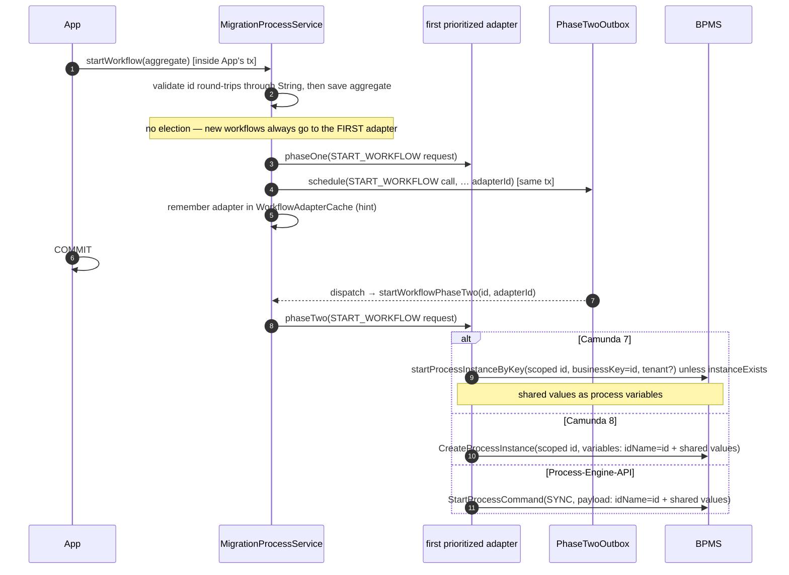

What stays untouched by this is the INBOUND direction: a BPMS which delivers a task
inside its own transaction still does, which `TaskInvocationContext.runInCurrentTransaction()`
reports. Inbound work may share the caller's transaction, outbound work never does.

The split itself is held by `AddingAnOperationTest#phaseOneRunsAndIsPlanned` and
`#phaseTwoIsDispatchedThroughTheRouter`, the resolution of the outbox per aggregate by
`StoreAttributionTest` respectively `QuarkusStoreAttributionTest`, and the boot which ends
without one by `OutboxStartupValidationTest`.

**What phase two may expect:** the dispatch calls back into the
application - a remote BPMS adapter loads the workflow aggregate to build what it
sends to the BPMS - and it does so on the outbox dispatcher's own thread, where
nothing the application relies on is active by itself. VanillaBP therefore provides
it: the `PhaseTwoRouter` runs every dispatch through the platform's
`TransactionRunner.requireTransaction`, which joins a transaction the store already
opened and starts one otherwise. On Quarkus that runner additionally activates the
CDI request context, without which an entity manager cannot be touched at all. Since
the guarantee sits in the router, an outbox contributed by an application gets it as
well, and stores which dispatch inside their own transaction (gruelbox on Spring
Boot) keep theirs. Spring Boot passes no runner today: gruelbox brings the
transaction, and Spring Data opens what it needs per call - see the platform's
wiki page for what an application may rely on.
`PhaseTwoRouterTest#dispatchRunsInsideTheProvidedTransaction` holds the transaction around a
dispatch, `PhaseTwoJpaContextTest` and `PhaseTwoMongoContextTest` what an application may touch
there.

**What phase two must not do: wait.** One thread dispatches the entries of a store, so whatever
an entry spends there is spent by every other entry of that node too, whatever workflow it
belongs to. The case which used to spend the most is a workflow its BPMS has not made searchable
yet: the election waited out the adapter's `workflowVisibilityDelay`, ten seconds on Camunda 8,
and a burst of "start, then correlate" pairs stalled in batches. Such an entry goes back to the
store with that window as its due time (`PhaseTwoRetryLater`) and the thread takes the next one.
The attempt is counted like any other, which is what ends a workflow that never becomes visible:
after `vanillabp.outbox.block-after-attempts` attempts the entry is blocked. The gruelbox store
on Spring Boot schedules the next attempt itself, from the `attemptFrequency` of the whole
outbox, so there such an entry comes back later than it had to, never sooner.
`NotVisibleWorkflowDoesNotStallDispatchTest` holds both halves: the entry of a findable workflow
dispatched while the other one waits, and the bound which finally blocks it.

**What a failed dispatch costs, and why the numbers are what they are.** The distance to the
next attempt grows: `PhaseTwoOutboxProperties#attemptDelay` returns `attempt-frequency` for the
first retry and doubles it per attempt until `max-attempt-frequency` caps it. Thirty seconds,
one minute, two, four, then five minutes for the remaining attempts, fifty of them, which is
close to four hours. The fixed distance it replaced was thirty seconds ten times, so an outage
of six minutes - a cluster upgrade - converted every pending operation of every node into a row
somebody had to repair by hand.
The two ends of the curve answer two different questions: the cap decides how long after a BPMS
comes back the first entry reaches it, the attempt budget decides which outage the store
survives alone, and blocking then means "this entry is broken" rather than "the BPMS was away
for a while". The stores VanillaBP owns compute the distance with that one method, so the curve
does not drift apart between platforms; gruelbox knows a single fixed distance and keeps it,
which the per-store table of the wiki pages owns.
The distance is written where a dispatch FAILED, not when the entry is claimed: the claim leases
the entry for one `attempt-frequency` so other pollers skip it, and a poller which dies
mid-dispatch therefore does not leave the long distance of an attempt nobody made behind.
`PhaseTwoOutboxPropertiesTest#theBackoffGrowsAndIsCapped` pins the sequence and
`#theAttemptBudgetSpansHours` the four hours.

**Blocking releases the deduplication key.** An entry which is blocked keeps everything else it
has, but its `DEDUP_KEY` (MongoDB: `dedupKey`) is replaced by the entry's own id, exactly as a
dispatched entry replaces it. Without that, a blocked entry silenced the repetition of the very
operation it failed at: the key is what refuses a second schedule, so the application asked, the
store said no, and that answer is indistinguishable from a correct deduplication - one failed
operation muted itself until somebody deleted the row, and only the counter
`vanillabp.outbox.discarded` made it visible at all. The blocked row stays for whoever repairs
it, so a repair now has to expect a second row for the same operation. Gruelbox holds its
`uniqueRequestId` until the row goes, so there the dead end remains.

A scheduled call is described by the immutable value type `PhaseTwoCall`
(operation, workflow module, BPMN process, workflow-aggregate ID in serialized
String form, elected adapter ID, operation-specific args). The dispatch chain is as
short as possible:

```
schedule(call)                dispatch(call)         handler.phaseTwo(request)
ProcessService ──► PhaseTwoOutbox (store) ──► PhaseTwoRouter ──► MigrationProcessService ──► adapter
      within local TX             after commit        (core-owned)     (adapter election)
```

The core-owned `PhaseTwoRouter` holds a registry `(workflowModuleId, bpmnProcessId)
→ MigrationProcessService`, filled by the platform integration at bean-creation
time. The serialized aggregate ID is converted back into the aggregate's ID type by
the process service itself (`convertAggregateId`, backed by
`AggregatePersistenceAware.getAggregateIdType()` and the core's
`AggregateIdRoundTrip` - the type is validated at startup to round-trip losslessly;
a `null` type means the custom persistence layer owns the serialized form and the
String is passed through). For `START_WORKFLOW` the adapter elected in phase one
**is persisted with the outbox entry** and used in phase two — no re-election from
the then-current priorities. If the adapter was removed from the configuration
while the entry was still open (stale entry), dispatching fails with a guiding
message naming that case. The other operations (message correlation, completing or cancelling a task, the
user-task pair, pushing a changed aggregate) probe the prioritized adapters at
dispatch time instead, so their calls carry no adapter ID; the exception is
`SEND_SIGNAL`, which names the broadcasting adapter because a broadcast reaches every
adapter of the module. Which of the two it is, is not written anywhere in the core: it
follows from the operation's `Election`, and so do the probe the core asks and the
patience it asks with.

#### An operation is defined once

An operation is a `PhaseOperation` (integration SPI) and nothing else. The record carries
everything about it which is not one BPMS' business:

- its **name**, which the store persists and which is therefore a contract: never
  rename an operation, never change what an existing name means,
- its **idempotency-key derivation** (`PhaseOperation.IdempotencyKey`, a function
  of the `PhaseTwoCall`), which is just as persisted as the name,
- its **election** (`Election`), which says which BPMS serves it: the first
  prioritized adapter for a start, whichever adapter holds the task, the user task or
  the workflow for the operations addressed to a running one, every deployed BPMS for a
  broadcast, and "the extension dispatches it itself" for an operation which never
  reaches an adapter. The core reads the probe, the patience and the shape of the
  "nobody knows this" failure off this one value,
- whether **every adapter has to serve it**, which decides whether a missing handler
  fails the boot or is an honest "this BPMS has nothing like it",
- whether the **activation** the call was planned in travels with it, and
- its **wording**: how the operation names itself in a log line or an exception
  ("correlating message 'approved'"), what to add where no BPMS knows the workflow, and
  what to do instead where an adapter cannot serve it.

What an operation DOES is the other place, and it belongs to the adapter: a
`PhaseOperationHandler` with `phaseOne(PhaseOneRequest)` and
`phaseTwo(PhaseTwoRequest)`, contributed per operation in
`MigratableProcessService#phaseOperations()`. That map is the only way an adapter
describes outbound work; there is no method per operation and phase any more.

**Adding an operation therefore costs one constant in `PhaseOperation` and one entry in
each adapter's map.** Nothing else: the outbox stores name, args and key without
knowing them, the router dispatches by name, and `MigrationProcessService` runs every
operation through `execute` and `executePhaseTwo`. `AddingAnOperationTest` adds one and
runs it through both phases to keep that true.

VanillaBP's own operations (`START_WORKFLOW`, `COMPLETE_TASK`, `CANCEL_TASK`,
`COMPLETE_USER_TASK`, `CANCEL_USER_TASK`, `CORRELATE_MESSAGE`,
`START_WORKFLOW_BY_MESSAGE`, `SEND_SIGNAL`, `AGGREGATE_CHANGED`) are constants of
`PhaseOperation`, registered by the `PhaseTwoRouter` while it is built. Their names and
key rules are pinned by `PhaseOperationContractTest`, because since they stopped being
enum constants nothing else guarantees them.

An adapter which cannot serve an operation every adapter has to serve is refused while
the application boots (`MigrationProcessService#validateAdapterOperationsAtStartup()`,
held by `AdapterOperationsAtStartupTest`). The map is the adapter's statement about what
it serves, so a forgotten operation is caught before a workflow waits for it — and it is
the whole question, because asking the adapter's class anything would mean reflection,
which is a lie in a native image: a method nobody registered looks like a method nobody
wrote, and every adapter of a native application would be refused.

`MigratableProcessService` is what an adapter implements, and its shape is the statement: a few
switches about what its BPMS can do, the probes the election walks, the map of handlers per
operation and the read-only methods the viewer reads through.

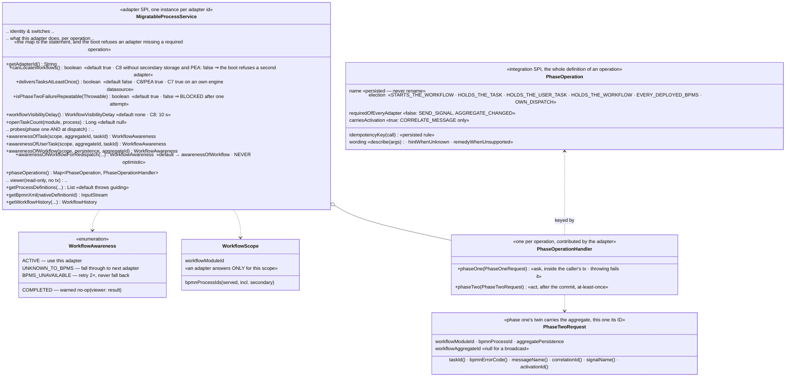

#### Operations of extensions

An **extension** contributes operations of its own, which is why the registry
(`PhaseOperationRegistry`) exists. It builds them with
`PhaseOperation.extensionOperation(name)`, which enforces a namespace
(`my-extension:MY_OPERATION`), and registers them together with its own dispatch:

```java
registry.register(
    PhaseOperation
        .extensionOperation("my-extension:NOTIFY")
        .idempotencyKey(call -> Optional.of(call.workflowAggregateId() + "|" + call.args().get("event")))
        .describedAs(args -> "notifying about '%s'".formatted(args.get("event")))
        .build(),
    (call, previouslyAttempted) -> notify(call));
```

The registry is offered as a bean by both platform integrations (Spring Boot:
`vanillaBpPhaseOperationRegistry`; Quarkus: a `@Singleton` producer). Scheduling
works as for core operations: build the call with
`PhaseTwoCall.of(operation, ...)` and hand it to the `PhaseTwoOutbox`, inside the
business transaction. Dispatch then goes straight to the extension's handler: the
aggregate-ID-to-adapter election of the core operations does not apply, and no
process service has to be registered for the call's BPMN process.

An extension whose operation addresses a workflow the way a core operation does says so
through its `Election` and hands it to `PhaseTwoRouter#registerOperation` instead. It is
then routed to the process services like a core operation, and every adapter which is to
serve it contributes a handler for it - which is what `AddingAnOperationTest` does.

Rules the registry enforces at registration time, each with a guiding message: an
operation is registered exactly once, an extension name is namespaced, and the core's
names are reserved. At dispatch time an unregistered name is an error naming the
operation and listing the registered ones. The entry stays in the store (like a
stale adapter ID of a START entry), so an extension temporarily missing from the
application does not silently lose its scheduled work.

Stores never look into the registry: they persist name, args and key and stay
operation-agnostic. `PhaseOperationRegistryTest` holds the rules the registry enforces, and
`ExtensionOperationDispatchTest` runs an extension operation through both platforms.

The core does not implement (or depend on) any outbox itself — it only defines the
`PhaseTwoOutbox` contract (stores implement exactly one method,
`schedule(PhaseTwoCall)`):

- **Scheduling:** `schedule(call)` MUST be invoked within the still-running local
  transaction that persists the workflow aggregate and MUST enlist the outbox entry
  in exactly that transaction: the entry becomes visible if and only if the
  transaction commits.
- **Idempotency key:** implementations MUST enforce uniqueness of
  `PhaseTwoCall.idempotencyKey()` (where present) via the store's unique-constraint
  mechanism; a duplicate `schedule` is a no-op returning `false`. For
  `START_WORKFLOW` the key is
  `START_WORKFLOW|workflowModuleId|bpmnProcessId|workflowAggregateId` — the
  storage-level enforcement of "a workflow is started at most once per aggregate".
  Every key names its operation, so completing and cancelling one task no longer
  share one; `START_WORKFLOW_BY_MESSAGE` deliberately derives the plain start's key.
  What a key deduplicates is the entries STILL WAITING for their dispatch, which is
  decision 22 of this repository: a repetition after the dispatch is a new operation.
  A store which discards a schedule returns `false`, and
  `MigrationProcessService#reportDiscardedSchedule` turns that into a WARN naming
  what was dropped, because a discard against a pending entry is as likely to be a
  lost operation as a redelivery. The same place counts it as
  `vanillabp.outbox.discarded`, tagged by operation, so the case can be alarmed on
  instead of being read: the count is taken in the core rather than in each store, which
  is why gruelbox and the VanillaBP stores report the same number. The key is bounded to 250 characters and hashed
  beyond that (`StoredKey`, shared with the inbound delivery key) — gruelbox refuses a
  longer unique request ID, and an aggregate ID longer than the 1024 characters of the
  `AGGREGATE_ID` column is refused where the call is built, with a message naming the
  column. The derivation rules per operation are documented on `PhaseOperation` and
  are a persisted contract.
- **The activation which planned a correlation is part of its key**, and of no other key
  (decision 23 of this repository). A called process is a secondary workflow of the SAME
  aggregate, so three elements of a multi-instance call activity used to derive one key
  and two of the three were discarded. `RunningActivation` is the thread-bound scope the
  core opens around a task delivery and around a workflow the BPMS started, filled from
  `TaskInvocationContext#getActivationId()` respectively
  `BpmsInitiatedStartContext#getNativeInstanceId()`.
  `CORRELATE_MESSAGE` is the one operation which says it `carriesActivation()`, so the
  core reads the scope into `ARG_ACTIVATION_ID` while it plans the call - the one path a
  correlation is planned on, and the one which runs on the handler's thread - and
  `PhaseOperation.CORRELATE_MESSAGE` derives from that argument, which keeps the
  derivation a pure function of what a store persists. Outside any invocation there is
  none and the key is what it always was, which is the fallback a REST endpoint and a
  thread the handler started themselves get. `START_WORKFLOW` and the task operations must
  NOT carry it: they deduplicate across activations on purpose.
- **The same argument reaches the adapter at dispatch time**, as
  `PhaseTwoRequest#activationId()`. Phase two runs on the dispatcher's thread,
  long after the thread which knew the activation has moved on, so the value travels with
  the entry rather than being read again. A BPMS which deduplicates messages in a net of
  its own needs the same distinction there: Camunda 8 derives a message id from the same
  values, and without the activation three multi-instance siblings reach the outbox as
  three operations and that cluster as one message.
- **Recovery:** every committed-but-unprocessed entry has to be dispatched through
  the `PhaseTwoRouter` right after the commit *and* after an application restart
  (crash recovery), retrying failed dispatches with a backoff.
- **DONE instead of delete:** a successful dispatch marks the entry DONE; physical
  deletion happens asynchronously after a configurable retention
  (`vanillabp.outbox.retention`, default 7 days) — which keeps a dispatched entry
  readable for support and does NOT extend the deduplication window: the store takes
  the key out of what enforces uniqueness when it marks the entry DONE. Entries
  failing repeatedly are blocked (ERROR log naming
  module/process/aggregate/operation) and left as a monitorable trail.
- **At-least-once residual window:** a crash between the remote BPMS call and
  marking the entry DONE re-dispatches the entry on recovery. This is accepted
  (eventual consistency); an adapter's handler MUST therefore tolerate a repeated
  phase two — a second `START_WORKFLOW` for an already-started workflow has to return
  without starting another workflow instance.
- **START re-dispatch mitigation (minimizes, does not close, the window):** stores
  pass "this entry was dispatched before" to
  `PhaseTwoRouter.dispatch(call, previouslyAttempted)` (the JDBC/MongoDB defaults
  claim entries by incrementing their attempts counter BEFORE dispatching, so a
  recovered/retried entry is recognized; the gruelbox default bridges its entry
  state via a `Submitter` wrapper — there the counter is only incremented on
  FAILED attempts, so a hard crash still re-dispatches without the probe). A
  previously attempted START entry probes the recorded adapter's
  `awarenessOfWorkflowForRedispatch` first: a workflow already known there means
  the previous dispatch succeeded — the entry is consumed without a second start.
  The probe's contract is stricter than the election's: NEVER optimistic (a wrong
  "known" loses a workflow; a wrong "unknown" merely yields the duplicate the
  residual permits anyway) — adapters that cannot query reliably answer
  `UNKNOWN_TO_BPMS`.

The picture puts the same start on a time line which crosses a crash: what the caller's
transaction commits, what the dispatcher picks up afterwards, and where the redispatch probe sits
between a repeated entry and a second workflow.

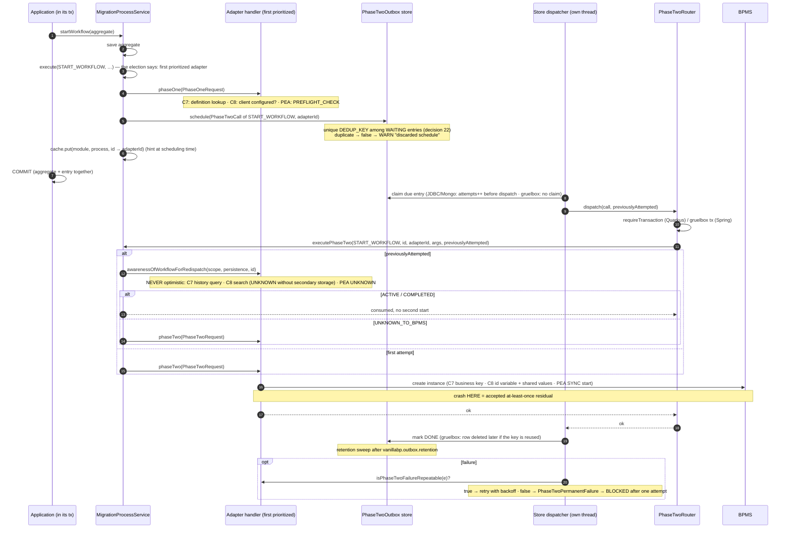

Every rule of that list has a test. Scheduling inside the transaction and dispatching after
the commit are `OutboxDispatchTest#entryWrittenInSameTransactionAndPhaseTwoDispatchedAfterCommit`
and `#rollbackLeavesNoEntryAndNoPhaseTwo`; the idempotency key is
`OutboxDispatchTest#duplicateScheduleAgainstAPendingEntryIsNoOp` next to
`RepeatedOperationTest#aSecondStartAfterTheDispatchIsPlanned`; the key released with the
dispatch is `GruelboxDeduplicationWindowTest#aDispatchedEntryIsReleased`; recovery after a
restart is `OutboxRecoveryTest`; the redispatch probe is
`OutboxRedispatchMitigationTest#retriedStartEntryDoesNotStartASecondWorkflow`; the
discarded schedule is `DiscardedScheduleTest`; and the activation carried by a
correlation's key is `ActivationIdentityTest` together with
`PhaseOperationContractTest#noOtherKeyCarriesAnActivation`. That a missing outbox ends the
boot is `OutboxStartupValidationTest`.

Default implementations are provided by the platform integrations (configured via
`vanillabp.outbox.*` — keys, defaults and documentation are modeled ONCE in the
core class `PhaseTwoOutboxProperties`, bound as part of the `vanillabp.*` tree;
applications may define their own `PhaseTwoOutbox` bean instead):

|  Platform   |       Persistence        |                                      Implementation                                      |
|-------------|--------------------------|------------------------------------------------------------------------------------------|
| Spring Boot | JPA                      | based on `com.gruelbox:transactionoutbox` (`spring-boot-integration`)                    |
| Spring Boot | MongoDB                  | own implementation using `MongoTemplate` (`spring-boot-integration`)                     |
| Quarkus     | JDBC datasource (Agroal) | own JDBC/JTA-based implementation (`quarkus-integration`; gruelbox does not support JTA) |

### Telling the application that a workflow ended (`WorkflowEndedInvoker`)

The counterpart of the BPMS-initiated start, and the one handler kind whose whole
point is that nothing depends on it:

- Adapters ask `workflowEndedHandlerExists(module, process)` while wiring and attach
  their listener only where the answer is yes. A model must not pay for a
  notification the application did not ask for, which is why the question exists at
  all instead of a plain "always attach".
- `workflowEnded(module, process, context)` loads the aggregate, calls the method and
  saves it, in the caller's transaction (embedded BPMS) or a new one (remote BPMS).
- A missing aggregate is NOT an error: an application may delete the aggregate of a
  workflow which ended, and a redelivered notification would find nothing either.
  Both cases are logged and skipped.
- What the context reports about the KIND of end is the adapter's honest answer, not
  a normalized fiction: Camunda 7 tells a cancellation from a regular end by the
  execution's delete reason, Camunda 8 never sees a cancelled instance's end.

`WorkflowEndedTest` holds all four bullets, `withoutAMethodNothingHappens` for the question
asked while wiring and `aDeletedAggregateIsNoError` for the aggregate which is gone.

### Broadcasting signals

A signal is the one BPMS operation which is not about a workflow, so it is the one
place where neither election nor aggregate applies:

- The scope is the WORKFLOW MODULE of the calling process service: each adapter
  broadcasts through ITS own client with ITS tenant, and the signal name is scoped
  like every other identifier of the module (prefixed in `use-prefix`). Crossing
  module boundaries is deliberately left to the application - a module is a scope,
  and which modules a signal is meant for is a business question.
- `MigrationProcessService.sendSignal(name)` fans out over the DEPLOYMENT UNION of the
  workflow module (`getDeploymentAdaptersFor`), not over the prioritized
  adapters of the calling process service. During a migration the subscriptions are
  spread across the BPMS, and a partial broadcast is worse than none.
- Every adapter is asked before the first failure is reported: a broadcast which
  stopped at the first unreachable BPMS would leave the others waiting.
- Every adapter gets one `SEND_SIGNAL` outbox entry, carrying its adapter id -
  dispatch goes to exactly that adapter, without probing. There is no idempotency key:
  nothing about a signal can be deduplicated.
- The call carries no aggregate ID, which is why `PhaseTwoCall` allows it to be
  absent. The router converts none where the call carries none.
- An adapter whose BPMS has no signals contributes no handler for `SEND_SIGNAL`, which
  is allowed because the operation is not required of every adapter: the application
  asking for one gets a `PhaseOperationNotSupported` naming the adapter and what to do
  instead.

`SendSignalTest` holds the fan-out over the deployment union (`everyDeployedBpmsIsReached`,
`oneFailingBpmsDoesNotStopTheOthers`), the adapter recorded per entry
(`phaseTwoUsesTheRecordedAdapter`) and the refusal (`anAdapterWithoutSignalsSaysSo`), in the
core and on both platforms.

### Pushing a changed aggregate (`aggregateChanged`)

`MigrationProcessService.aggregateChanged(aggregate, taskId)` is `correlateMessage` with
another verb: save the aggregate, locate the BPMS and schedule an `AGGREGATE_CHANGED` outbox
entry. A completed workflow is a warned no-op, an unknown one a `WorkflowNotFoundException`
naming that the aggregate WAS saved. Locating means probing `awarenessOfWorkflow`, except where
the call names a task and the delivery record of that task is still open - then the record
answers, see [the record answers which BPMS holds a task](#the-record-answers-which-bpms-holds-a-task).

Two decisions are worth knowing:

- **No idempotency key.** The values are read from the aggregate when the entry is
  DISPATCHED, so a redelivered entry writes the then-current state. A key could only ever
  drop a push, never save one.
- **The task id decides the scope and nothing else.** Without one the values belong to the
  workflow's global scope, with one to the scope that task RUNS in (process, embedded
  subprocess, or one iteration of a multi-instance embedded subprocess) - never the task's
  own scope, and never additionally the global one, or the other iterations would see what
  one of them pushed. Which execution or element instance that is, is the adapter's
  business; the core only transports the id (in `ARG_TASK_ID`).

There is no ordering guarantee between outbox entries: the dispatchers select by due time
(`NEXT_ATTEMPT_AT <= now`) without an `ORDER BY`, so a push and a task completion scheduled
in the same transaction may reach a remote BPMS in the other order. That is documented
rather than fixed - inventing an order here would promise something the stores do not
implement, and an application which needs one can keep the calls in separate transactions.

`AggregateChangedTest` holds the shape and both decisions (`theTaskIdDecidesTheScope`,
`phaseTwoElectsByProbing`, `aCompletedWorkflowIsNoFailure`, `anUnknownWorkflowFailsGuiding`).
The missing ordering has no test because there is nothing to hold: the sentence says what
the stores do not promise.

WHAT is pushed stays the sync model's business. This operation adds no second
way of choosing values, which is what keeps the aggregate the single source of truth.

Which values a BPMS gets to see is computed in one place and written at several, and that is what
the picture shows: the aggregate's annotations decide the map, the core computes it, every
outbound operation carries it to the BPMS, and nothing in VanillaBP ever reads it back.

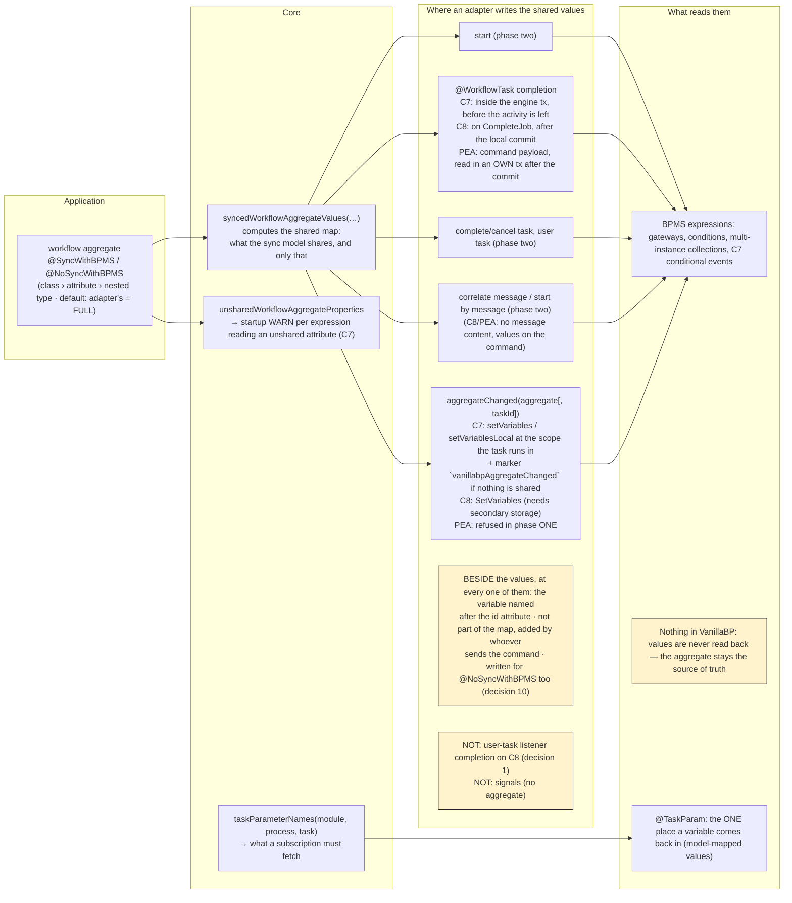

### Workflows the BPMS starts itself (`BpmsInitiatedStartInvoker`)

A timer, signal or conditional start event produces a workflow nobody asked for - and
therefore a workflow without a workflow aggregate, which is the one thing every other
mechanism needs: tasks are routed by the aggregate's ID, expressions read its
attributes. The core builds it, adapters only report and write back.

Adapters use the SPI (`io.vanillabp.integration.adapter.spi.workflowstart`) twice:

- `validateBpmsInitiatedStarts(module, process, specs)` during `wireBpmn`, with the
  start events of the deployed process the BPMS fires on its own. The core registers
  them and reports an application method serving a process (or a start event) which
  has none. Signal names are reported PLAIN - scoping stays invisible above the BPMS
  boundary. Throwing honors the `deployment-failure` policy.
- `startWorkflowByBpms(module, process, context)` when the BPMS reports such a start.
  The context carries values only: start event id, kind, trigger time, the BPMS' own
  identity of the start, the variables the model set, and whether the aggregate has to
  be built in the CALLER's transaction (embedded BPMS) or in a new one (remote BPMS).

What the core does, in one transaction: derive the ID, reuse an aggregate already
carrying it (a repeated notification builds nothing twice), otherwise instantiate the
class, write the ID and the variables into it, run the optional
`@WorkflowStartedByBpms` method and save. The result carries the aggregate's ID, the
name of its ID attribute and the variables the adapter writes back - the ID variable
plus the values shared per `@SyncWithBPMS` where the adapter asks for them
(`AggregateSyncMode`).

The ID rules live in `BpmsInitiatedStartId`: what the BPMS identifies the start by
wins (a remote BPMS' instance key, stable across redeliveries), then a timer's trigger
time, then a generated ID - and where none of them fits the ID attribute's type,
nothing is assigned and the persistence layer generates one while saving.

The `@WorkflowStartedByBpms` methods are scanned by `BpmsInitiatedStartScanner` and
held by `BpmsInitiatedStarts`, to which `WorkflowTaskRegistry` delegates the second
adapter-facing interface. Both scanners walk the same classes and share the value
conversion; folding them into ONE pluggable handler contract is the subject of the
extension-enablement story.

An adapter whose BPMS cannot report such a start implements none of this and fails the
deployment of such a process with a guiding message instead - a workflow which could
never obtain an aggregate is better refused than deployed.

The other direction is drawn below, a start the BPMS decided on: the adapter reports it, the core
derives the ID and builds the aggregate, and the adapter writes the ID back into the running
instance.

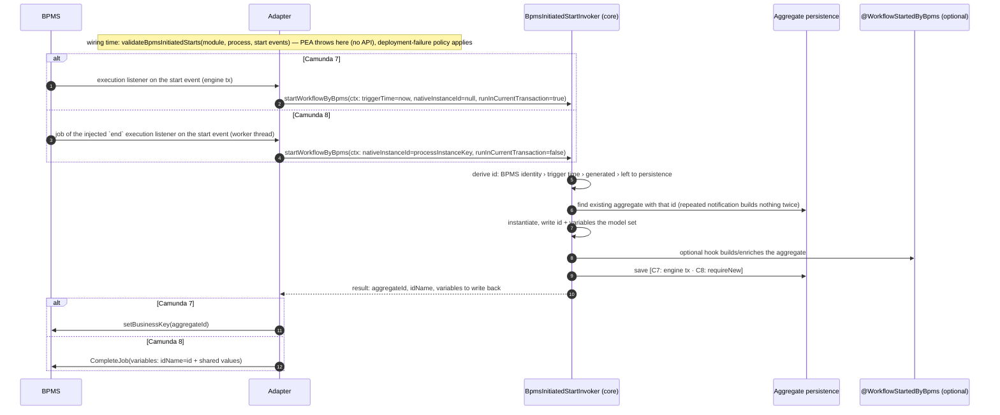

Building and validating are `BpmsInitiatedStartTest` (`aggregateIsBuiltFromTheTrigger`,
`repeatedNotificationCreatesNothingTwice`, `methodNamingAnUnknownStartEventFailsTheBoot`), the
ID rules are `BpmsInitiatedStartIdTest`.

### Viewer/history API (read path)

`ProcessService#getProcessDefinitions`, `#getBpmnXml` and `#getWorkflowHistory` are
read-only: no aggregate is saved, no transaction is required and no workflow is
advanced. All three live in `WorkflowViewer`, which the process service holds and
delegates to - the reading half has an election of its own and shares nothing with the
writing half but the walk. The BPMS answering is elected by the same probing/caching
`WorkflowLocator` walk as every other operation on an existing workflow — with one
difference: `COMPLETED` is a REGULAR result (viewers show ended workflows), only a
workflow unknown to EVERY adapter raises the SPI's `WorkflowNotFoundException`.

**Composite process definition ids.** `getBpmnXml(processDefinitionId)` addresses a
process DEFINITION, not a workflow — there is no aggregate to elect a BPMS by. The
core therefore namespaces every adapter-native definition id it hands out (also the
one inside `WorkflowHistory#processDefinitionId()`):

```
<adapter id>#<adapter-native definition id>
```

Split at the FIRST `#` (adapter ids are configuration keys and never contain one;
native ids may, e.g. Camunda 7's `MyProcess:1:8a9c…`). The scheme is modeled in
`ProcessDefinitionIds` and is a stable contract: applications may store such ids
(e.g. in a viewer's URL). Adapters only ever see their native ids — the core strips
the namespace before calling `MigratableProcessService#getBpmnXml` and routes to the
adapter named by it (unknown adapter, malformed id or unknown definition →
`ProcessDefinitionNotFoundException`, each with a guiding message).

Adapters answer "I do not know this workflow" with an empty list / `null`; a BPMS
without an element history reports `elementsHistory()` as `null` (the SPI's
"not supported by the underlying BPMS"), and an eventually consistent BPMS reports
what is visible instead of raising an error.

The composite id and the read path are `ViewerApiTest` (`compositeIdSchemeRoundTrips`,
`bpmnXmlIsRoutedByTheCompositeId`, `completedWorkflowsAreViewable`,
`malformedProcessDefinitionIdRaisesGuidingError`).

### Aggregate persistence

The core does not know any persistence technology.
`io.vanillabp.integration.spi.AggregatePersistenceAware` (module `integration-spi`)
abstracts saving an aggregate and determining its ID. Implementations are provided by
the platform integration (e.g. based on Spring Data) or by the business application
itself; the implementation with the most specific generic type for the aggregate wins.
It is the single canonical interface used on all platforms — business code implements
it regardless of running on Spring Boot or Quarkus.

### What the platform hands a process service (`MigrationProcessService.Builder`)

One process service exists per workflow module and BPMN process, and it is built rather
than constructed: `MigrationProcessService.forBpmnProcess(module, process, aggregateClass)`
opens a builder, and what follows names what it is given. Three of those are mandatory -
the bound configuration, the persistence of the workflow aggregate, and the process
services of the adapters - and `build()` refuses a set without one, naming the BPMN process
and every missing name. The rest are what a platform integration always hands over and a
test leaves out where it does not need it: `workflowAdapterCache` (without it every
election probes), `taskDeliveryLogResolver` (without it deliveries are not deduplicated),
`transactionRunnerResolver` (without it the runner the caller passes is used) and
`phaseTwoOutboxResolver`, whose absence `validatePhaseTwoOutboxAtStartup` reports at
startup. Before this there were four constructors of seven to ten parameters, and a call
site said `null, null` where a reader had to count positions to learn what was left out.

### What the platform hands an adapter (`AdapterCollaborators`)

An adapter takes ONE object in its constructor, built by the platform integration it runs
on (`AdapterBeanRegistrarSupport.collaborators` on Spring Boot,
`AdapterCollaboratorsSupport.collaborators` on Quarkus). Five collaborators are mandatory,
because both integrations provide them for every application:

|        collaborator         |                                               what the adapter does with it                                               |
|-----------------------------|---------------------------------------------------------------------------------------------------------------------------|
| `WorkflowTaskWiring`        | asks while it reads a BPMN file: is this task wired, what is the aggregate-ID name, which parameters does the method read |
| `WorkflowTaskInvoker`       | hands a delivered task to the application                                                                                 |
| `NameClashAvoidanceSupport` | scopes what it deploys, so two workflow modules on one BPMS do not collide                                                |
| `WorkflowAggregateSync`     | which values of a workflow aggregate the BPMS may see                                                                     |
| `PreCommitRegistrar`        | hangs work which has to run before the caller's transaction commits                                                       |

A set built without one of them throws, naming the adapter id and what is missing. Two more
are handed over as `Optional`, because an adapter has to work without them - an application
which asks for neither has nothing to report to:

|        collaborator         |                                          what the adapter does with it                                          |
|-----------------------------|-----------------------------------------------------------------------------------------------------------------|
| `WorkflowEndedInvoker`      | reports that a workflow ended, and asks whether a process even needs the listener                               |
| `BpmsInitiatedStartInvoker` | reports a workflow the BPMS started by itself, and validates the start events against the application's methods |

Both platforms do provide those two today, out of the same core bean as the mandatory ones,
so an adapter built without one is nearly always a registration which left it out - and the
build writes a WARN naming the adapter id and the collaborator. Decision 28 says why the
object exists at all: the collaborators used to arrive by setter, and a registrar which
forgot one produced an adapter that deployed, ran tasks and never reported a workflow end,
with nothing failing anywhere. `AdapterCollaboratorsTest` holds both halves, the refusal of
a missing mandatory collaborator and the WARN about an absent optional one.

What is NOT in the object stays the adapter's own constructor argument: what it resolves
from its configuration (a job timeout, a retry backoff, the variables a worker fetches) and
what its own extension contributes (its metrics).

Where the collaborators come from differs per platform, which the picture puts side by side: the
adapter's Spring Boot module registers one bean per configured id, its Quarkus modules produce the
same per id through a build step and a producer, and both hand the adapter the one object. The
integration SPI at the bottom is the part an adapter never implements itself.

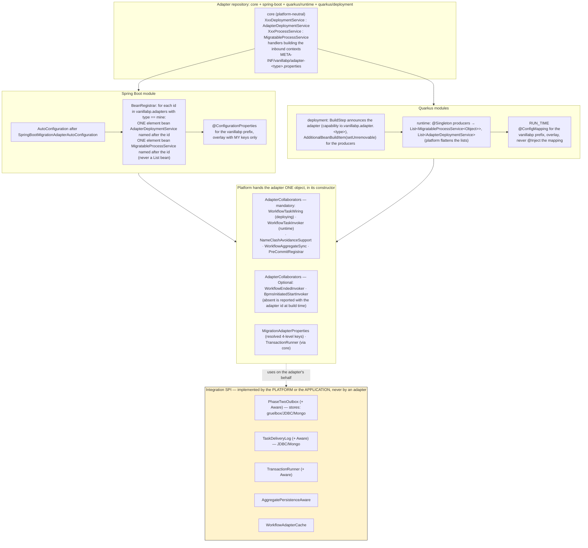

### The transaction the work runs in

VanillaBP wraps everything it does around one workflow aggregate in ONE transaction: the
lookup of a processed delivery, loading the aggregate, invoking the `@WorkflowTask` method,
saving the aggregate, writing the delivery record and scheduling a phase-two outbox entry
either all commit or none of them do. Which runner is chosen for an aggregate is held by
`TransactionRunnerResolutionTest`, plus `SpringTransactionRunnerResolverTest` and
`QuarkusTransactionRunnerResolverTest` per platform; that the six steps really share one
transaction is proved per platform by the outbox and delivery integration tests rather than
by a unit test. The core's abstraction for it is
`io.vanillabp.integration.spi.TransactionRunner` (module `integration-spi`, with `requireNew`,
`inCurrent` and `requireTransaction`), and every platform provides an implementation of it.

Three transaction boundaries meet in the core, and the picture is about which work belongs to
which of them: the transaction the application opened, the one the dispatcher runs phase two in
after that commit, and the inbound one an adapter's worker or engine thread brings along.

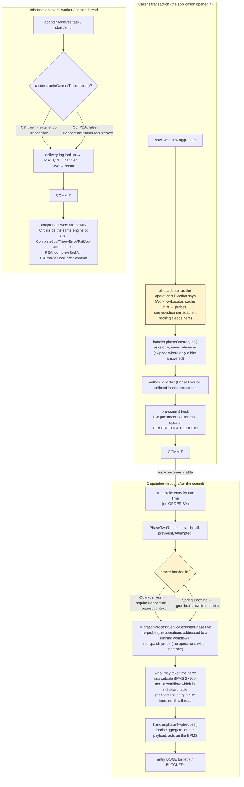

An application whose aggregates live in a system the platform does not manage implements the
runner itself, and `TransactionRunnerResolver` (implemented per platform) picks it in four
steps:

1. the most specific `io.vanillabp.integration.spi.TransactionRunnerAware` bean covering the
   aggregate class (`AwareSelection`, so interfaces count and a bean naming the aggregate
   beats one naming an interface it implements; a tie ends the boot naming both beans),
2. a plain `TransactionRunner` bean of the application, serving every aggregate no aware bean
   covers,
3. the platform's own runner, if it can work at all - on Spring Boot that means a unique
   `PlatformTransactionManager` exists,
4. nothing, which ends the boot with a guiding message: the aggregate and the outbox entry
   have to be written in one transaction, so such an application cannot start a single
   workflow.

The resolver also reports what the transaction COVERS (`TransactionCoverage`): a store the
platform can tell is not covered gets a WARN, a combination it can name a fix for ends the
boot unless the application accepts it with
`vanillabp.transactions.unguarded-aggregate-writes`, and a store the platform cannot judge -
an `AggregatePersistenceAware` implementation writing wherever it wants - is not commented
on. `MigrationProcessService.validateTransactionRunnerAtStartup()` turns those verdicts into
messages and logs one line per aggregate naming the runner serving it.

### Extensions

An extension participates in two steps of the [deployment pipeline](#deployment-pipeline)
through `ExtensionWiringService<BPMN, PC>`:

|                           Method                            |                 Called                  |                                       Purpose                                        |
|-------------------------------------------------------------|-----------------------------------------|--------------------------------------------------------------------------------------|
| `getModelType()`                                            | at wiring time                          | the BPMN model type this extension understands, e.g. Camunda 7's `BpmnModelInstance` |
| `getProcessContextType()`                                   | at wiring time                          | the adapter's processing-context type this extension expects                         |
| `getOrder()`                                                | once, at startup                        | ordering among all wiring services of the same model type (default `0`)              |
| `wireBpmn(module, filename, bpmnProcessId, model, context)` | per executable BPMN process             | inspect the model and wire the extension's own concerns against it                   |
| `startWorkflowProcessing(module, context)`                  | after the module was deployed           | start whatever consumes that wiring (listeners, workers, …)                          |
| `stopWorkflowProcessing(module, context)`                   | on graceful shutdown (default: nothing) | stop it again                                                                        |

**Matching — an extension is either asked, or it is not.** An extension takes part in a
module's deployment only if BOTH declared types are assignable from the adapter's types:
the model type AND the processing-context type. A Camunda 7 extension therefore stays
untouched while a Camunda 8 module is deployed, and an extension declared against
`Object`/`Object` sees every BPMS. This is also the trade-off to be aware of: an extension
that wants to CONTRIBUTE to the adapter's processing context has to declare that adapter's
context type and thereby becomes BPMS-specific, whereas an extension that only reads the
model can stay generic.

**Ordering.** All wiring services of a module — adapters and extensions — are sorted by
`getOrder()` ascending, once at startup. Order matters whenever two of them touch the same
model: VanillaBP's own wiring decides which BPMN elements are served by `@WorkflowTask`
methods, so an extension reacting to that result has to run afterwards (the Business
Cockpit's listeners are consistently ordered last). Shutdown is the mirror image:
`stopWorkflowProcessing` runs on the extensions first (in reverse wiring order), then on
the adapters, so nothing is stopped while something else still feeds it.

**An extension may define its own SPI.** `wireBpmn` is where an extension's own
annotations become alive — the Business Cockpit finds `@UserTaskDetailsProvider` methods
there, just as VanillaBP finds `@WorkflowTask` methods. Such an SPI belongs to the
extension, **never to the VanillaBP core**: the core knows nothing about user-task details,
and an application not using that extension must not see its annotations.

**Registration** is platform-specific and the dummy extensions of both platform
integrations' test modules are the templates:

- *Spring Boot* — contribute a bean of type `ExtensionWiringService`, usually from an
  auto-configuration ordered after `SpringBootMigrationAdapterAutoConfiguration`. All
  beans of that type are collected; since the adapters' deployment services are wiring
  services too, they appear in the same collection and the platform filters them where
  only extensions are meant.
- *Quarkus* — the extension is a Quarkus extension: its runtime module `@Produces` the
  wiring service (`@Singleton`, because such services usually have no no-arg constructor
  and are therefore not client-proxyable), its deployment module registers that producer
  via `AdditionalBeanBuildItem` with `setUnremovable()` — the platform looks the beans up
  through `Instance`, so ArC would otherwise remove them. Unlike adapters, extensions
  announce no build item.

**Configuration** is the extension's own: on Quarkus as an overlay
`@ConfigMapping(prefix = "vanillabp")` if it wants to live under the `vanillabp.*` tree, on
Spring Boot as a second `@ConfigurationProperties("vanillabp")` class. VanillaBP's own
configuration is available as the injectable core object `MigrationAdapterProperties`
(adapter ids, workflow modules, prioritized adapters), which is usually all an extension
needs to know about the setup.

**What holds the matching and the ordering.**
`DeploymentServiceTest#extensionWiringServicesAreFilteredAndCalled`,
`#subtypeExtensionIsNeitherWiredNorStarted` and `#wiringServicesAreSortedByOrder` in the
core, `DeploymentPipelineTest#extensionsWiredInOrder` and `#nonMatchingExtensionUntouched`
against a booted application.

### Adapter/platform version guard (`AdapterPlatformVersion`)

Applications pin the VanillaBP versions themselves, usually by importing
`io.vanillabp:vanillabp-bom`. Maven resolves a version managed by the application
*before* the version an adapter requires transitively, silently and even if that means a
DOWNGRADE — no conflict is reported and the build stays green. An adapter newer than the
platform integration then fails at runtime with `NoSuchMethodError` /
`NoClassDefFoundError` deep inside the adapter.

Two consequences shape the guard:

- **The check belongs to the ADAPTER, not to the platform integration.** Only the adapter
  knows the platform version it was compiled against, and a too old platform integration
  cannot contain a check that was added later. The platform side only provides the
  mechanism.
- **The version numbers have to travel in the JARs.** `vanillabp-adapter-spi` carries
  `META-INF/vanillabp/platform-version.properties` (filled by resource filtering), each
  adapter core carries `META-INF/vanillabp/adapter-<adapter-type>.properties` with its own
  version and the platform version it was built against
  (`platform.version=${adapter-platform.version}`). The per-adapter-type file name keeps
  the descriptors apart when several adapters are on the classpath — the normal case
  during a BPMS migration.

Adapters call `AdapterPlatformVersion.requireCompatiblePlatform(adapterType, someCoreClass)`
in the constructor of their `AdapterDeploymentService` implementation, which runs once per
configured adapter id on both platforms; results are cached per adapter type, failures are
not. Versions are compared by their numeric parts with the qualifier ignored, so
`2.0.0-SNAPSHOT` satisfies a required `2.0.0`; versions that cannot be parsed count as
compatible — the guard must never break a build it does not understand. When it does fail,
the message names the required version and every artifact to raise (starting with the
BOM), following the [configuration/error-message principle](#features) of guiding the
developer instead of just reporting. The comparison and both escape hatches are `AdapterPlatformVersionTest`:
`testQualifiersAreIgnored`, `testUnparseableVersions` and `testFailureIsNotCached`.

## The older versions a BPMS still holds

A BPMS keeps every version of a process it was ever given while the application brings only
its newest model, so "does this application still serve version 1" is a question only the
BPMS and the registry together can answer. The check runs once per BPMN process after the
module was deployed, next to the version-tag resolution in
`WorkflowTaskRegistry#resolveProcessVersions`.

The split follows the rule of this project: reading a model is BPMS-specific, deciding what
it means is not.

- The adapter answers two optional questions of `ProcessVersionCatalog`:
  `tasksOfVersion` reads the model the BPMS still holds and builds the same `BpmnTaskSpec`
  list `wireBpmn` builds (both adapters extract it once and use it for both directions, so
  the two cannot drift), and `activeInstanceCountOf` counts the workflows of that version.
  A BPMS which cannot answer returns `null`, which switches the respective half off instead
  of inventing an answer.
- The adapter also reports what it deployed, through
  `WorkflowTaskInvoker#registerDeployedVersion`. That is the border between "the model this
  boot brought" and the older ones, and it is what makes fading out the deployed version a
  boot failure. Watch out for the case where the BPMS deploys NOTHING because the resources
  did not change - the version has to be reported anyway, otherwise the check would only
  ever run on a boot which changed a model (Camunda 7 queries the latest version for that).
- The adapter answers one more question, and not while it deploys:
  `AdapterDeploymentService#processVersionCatalogOf` says what its BPMS holds for a BPMN process
  the application declares without deploying a model under it. See below, "A BPMN process nothing
  was deployed under".
- `DeployedProcessVersionsCheck` owns the decisions and every message: which versions are
  older, which are faded out (`OutfadedProcessVersions`, the `outfaded-versions` property in
  the grammar of `VersionRange`), which task definitions of a version nobody serves
  (`WorkflowTaskRegistry#tasksNotServedInVersion`, version-aware and marking nothing as
  wired), and which methods serve no version worth serving at all
  (`handlersNotServingAnyVersion`, for all three annotations carrying a `version`).

Two rules govern the reverse direction. A method whose version range
excludes the deployed version needs no task in the deployed model - without that exemption
an application could only serve an old version by keeping a dead task in its current BPMN -
and the same exemption applies to a `@WorkflowStartedByBpms` method naming a start event the
new model dropped. What used to be caught by those checks is caught by the dead-method
warning instead, which reports rather than fails: a version which does not exist YET is
normal during a rolling deployment.

Every verdict the check can reach is a case of `OldProcessVersionsTest`, from
`anUnservedVersionWithInstancesIsAnError` and `anUnservedVersionWithoutInstancesWarns` to
`outfadingTheDeployedVersionFailsTheBoot` and `aMethodServingNoHeldVersionIsReported`.

### A BPMN process nothing was deployed under

Renaming a BPMN process is the one refactoring which reaches into the BPMS: the old
`bpmnProcessId` stays there with every version ever deployed under it and with the workflows
still running on them, while the application brings only the new name.
`@WorkflowService(secondaryBpmnProcesses = @BpmnProcess(bpmnProcessId = "<old id>", version =
"<the old versions>"))` is where the application says that it answers for both, and the registry
follows the DECLARED ids, so a task of an old workflow finds its handler.

What the declaration could not do by itself was reach the check. An adapter registers the versions
of the processes it just deployed, and nothing was deployed under the old id - so the versions the
running workflows are on were the only ones nobody ever looked at, and the first news of a method
somebody dropped was an incident. The core closes that gap because it is the only side which knows
the declarations: once every adapter of a workflow module deployed, `DeploymentService` asks each
of them `processVersionCatalogOf(module, process)` for every declared id `wiringValidated` is
false for, and registers the answer like any other catalog. An adapter answering `null` - the
default - keeps working exactly as before.

Three consequences run through the check from there:

- `deployedVersion` is `null` for such an id, and that now has two readings: a BPMS which counts
  no versions (nothing to check, as before) and an id nothing was deployed under, where EVERY
  version the BPMS holds is an older one. `DeclaredBpmnProcesses` is what tells the two apart.
- the verdict "this method never runs" became a statement about the whole workflow module.
  Each method is registered once per declared BPMN process, with the range of that declaration,
  so a method kept for the old id serves none of the new id's versions on purpose. The check
  collects what every process of the module can be served with and draws the verdict once, in
  `reportDeadHandlers(module)`; `HandlerVersions` is the per-registration answer the three handler
  kinds give it.
- the reverse wiring check exempts a method registered for a declared-only id the same way it
  exempts one serving only older versions: no model of this boot carries the task it is wired to.
  This is why the core asks the adapters BEFORE `validateNoUnwiredWorkflowTaskMethods`.

The check is one half of what such an id needs; the other is that its workflows keep being served,
and that half belongs to the adapters. `WorkflowTaskWiring#taskWiringOfProcessesNobodyDeployed`
is where they read the declared ids together with what the application serves for each of them,
which the registry answers from the same entries the version question uses
(`entriesNobodyDeployed`), so both speak about exactly the same ids. Why that method is named
after the question and not after today's answer, which is the `taskDefinition` of a method, is
decision 34 of `DECISIONS.md`. What an adapter does with them
is its own decision, because the need differs per BPMS: an identifier which does not carry the
process id reaches the old id by itself, while a Camunda 8 job type under `use-prefix` does carry it
and the jobs of those workflows then wait for a worker nobody opened. A method wired to a BPMN
element id contributes nothing there, since reading an element's task definition needs the model
which is exactly what is missing, so an id can be named with an empty answer.

Watch the numbering when you configure anything for such an id: each BPMN process id is counted
from 1 by its BPMS, so the versions of the old id and of the new one are different things with the
same names. `outfaded-versions` therefore belongs at the workflow level
(`vanillabp.workflow-modules.<module>.workflows.<old id>.adapters.<adapter>.outfaded-versions`);
the same specification at adapter level would cover the version the application just deployed
under the new id and end the boot for that reason. `RenamedBpmnProcessTest` holds all of it, and
the recipe for a rename is the wiki page
[Renaming a BPMN process](https://github.com/vanillabp/adapter-platform-integration/wiki/Renaming-a-BPMN-process).

### What the check costs, and what it may cost in two years

One question for the versions the BPMS holds, then two per version older than the one this boot
deployed. Every one of them is a query, so the check is where a start would most easily start
growing, and decision 19 of `DECISIONS.md` is the rule it has to keep: a start asks for numbers,
never for the rows themselves, and how many questions it asks belongs to the shape of the
application rather than to its history.

Two places make that true, both of them easy to undo by accident. `InstanceCounts` inside the
check asks the BPMS for the workflows of a version once and answers all three reports which want
that number from the memo; before it existed the same query went out three times per version. And
on the adapter side, the handle of an older version comes out of the list of versions which was
just read rather than out of a query of its own, which is what both adapters do in their
`ProcessVersionCatalog` implementations.

What is allowed to grow is the number of versions, one per deployment which changed a model, and
`outfaded-versions` is the operator's way to cut it off. A BPMN process the application declares
without deploying it counts as one process more, asked about like any other; that number follows
the declarations in the code, which change when somebody edits them. The guards count questions rather than
measure time: `OldProcessVersionsTest#theQuestionsDoNotDependOnHowManyWorkflowsRun` here,
`Camunda7StartupQuestionCostTest` and `Camunda8StartupQuestionCostTest` in the adapters.

## Two writers on one workflow aggregate

A workflow aggregate has one workflow, which reads like one writer - until the process holds
a second token. Then one branch writes in the transaction VanillaBP owns for its task and the
other in the transaction the application opens around its API call, and since a persistence
layer writes the whole record, the branch committing second puts back what it read at its
start. It was found while building blueprints, three times over: two branches of a boundary
event, two branches of an escalation, and two branches writing entities of their own which the
aggregate points at.

The core answers the part it owns, and only that part:

- Recognizing the conflict belongs to the platform. The core is plain Java and must not know
  `OptimisticLockingFailureException` or `jakarta.persistence.OptimisticLockException`, so
  `TransactionRunner#isConcurrentModification(Throwable)` asks the platform, through the same
  seam the transaction itself goes through. What is not platform-specific sits in
  `AggregateWrite#causedByOptimisticLocking`: matching the exceptions of a persistence layer
  along the chain of causes, by NAME.
- One helper around the transaction, not one per call site.
  `AggregateWrite#inTransaction` runs the work (`requireNew` or `inCurrent`), logs ONE guiding
  ERROR if the failure is a conflict and rethrows it unchanged. It sits at every place the
  core commits a transaction of its own: `MigrationProcessService#executeWorkflowTask`,
  `BpmsInitiatedStartExecution` and `WorkflowEndedHandlers`. The operations an application
  calls itself (`startWorkflow`, `correlateMessage`, `aggregateChanged`, the task operations)
  save inside the CALLER's transaction, so their conflict surfaces in the application's own
  commit. That one is the application's to catch, which is why the wiki says so instead of the
  core pretending to handle it.
- Nothing is retried. A handler may have called a remote API before the commit failed, so a
  quiet retry would repeat that call and hide the failure at the same time. The adapter gets
  the original exception and maps it to its BPMS' retry semantics.
- The startup hint is split the same way as the old-versions check. The adapter reads its
  model and reports the elements which can produce a second token
  (`WorkflowTaskInvoker#reportConcurrentTokenElements`), the core decides what it means:
  `ConcurrentTokenCheck` asks the aggregate class for a version attribute, by the SIMPLE name
  of the annotation so JPA and Spring Data are covered without a dependency on either, and
  warns once per BPMN process where there is none. An aggregate with a version attribute stays
  quiet, because then the collision is the exception above instead of a lost write.

`AggregateWriteConflictTest` holds the classification and the report
(`optimisticLockingIsRecognizedByName`, `conflictIsReportedAndPropagated`,
`otherFailuresArePassedThroughSilently`, `theWarningIsGivenOncePerProcess`), and each
platform runs the same conflict through a booted application.

## What an operator gets to see

Three things about one delivery, built in the core because every BPMS passes through it:
the delivery is counted and measured, the log lines written while it runs name the workflow,
and the adapters answer a health question the platform publishes.

`MigrationProcessService#executeWorkflowTask` is the single place all of it hangs on. It is
where the transaction is opened, so a timer around it measures the handler plus the commit
rather than the handler alone, and it is where a delivery which throws still produces an
outcome to count. Everything the adapters do is upstream of it, everything the application
does is inside it, and nothing had to be repeated per BPMS.

- `VanillaBpMetrics` is plain Java with a no-op `NONE`, and `MicrometerVanillaBpMetrics`
  implements it plus `MeterBinder`. That is the same optional-Micrometer wiring the election
  cache uses (`WorkflowAdapterCacheMeters`), and reusing it is the point: both platforms apply
  `MeterBinder` beans to their registries by themselves, so no code of ours ever asks for a
  registry. Before the binding there is no registry and every record is dropped, which is the
  normal state while beans are being built.
  The meters are cached per tag combination, because a delivery must not pay for its own
  measurement, and the tag values are what a deployment fixes: adapter id, workflow module,
  BPMN process, task definition, operation. Never an aggregate id or a job key - those would grow
  one time series per workflow, and they belong in the log anyway.
  Two of the counters are not about a delivery at all. `vanillabp.outbox.discarded` says how
  often an operation the application asked for was NOT planned, because the outbox found one
  of the same idempotency key still waiting for its dispatch. Which of the two causes it was
  cannot be told here: a redelivered dispatch of a recorded call loses nothing, a second,
  legitimate operation of the same key loses everything and leaves a workflow waiting for a
  message nobody sends again. That is why it is a counter and not a log line alone. Alert on
  it, read the WARN it comes with, and where the cause is a repeating scope, vary the
  correlation id per round or element (see [two-phase workflow start](#two-phase-workflow-start-phasetwooutbox-spi)).
  And `vanillabp.task.elections.from.record` says
  how often a call naming a task was routed without asking any BPMS, which is the number the next
  step of that feature is decided on, see [the record answers which BPMS holds a
  task](#the-record-answers-which-bpms-holds-a-task).
- `DeliveryMdc` is a `try`-with-resources remembering the previous values of its six keys and
  putting them back, so a thread the application uses for other work is handed over unchanged.
  It is used around the task delivery and around the phase-two dispatch in `PhaseTwoRouter`,
  which is where a broken BPMS connection does its logging.
- Health is `AdapterDeploymentService#checkHealth()`, defaulting to `null`. Absent is honest,
  `UP` would be a claim nobody checked, and an adapter written before this existed keeps
  working. `AdapterHealthReport` collects the answers, turns a thrown exception into `DOWN`
  (a health endpoint has to answer even when an adapter misbehaves) and computes the overall
  status, where `UNKNOWN` is not worse than `UP`: an adapter which is not configured yet is
  not an outage.
- The outbox backlog is `PhaseTwoOutbox#pendingCalls()`, an `OptionalLong` defaulting to empty.
  A store which cannot count publishes no gauge, which is honest where a zero would not be.
  All four stores VanillaBP ships implement it with one indexed count; gruelbox has no API for
  it, so its store reads the table gruelbox created, along the index gruelbox created with it.
  On Quarkus the gauges are registered by a `StartupEvent` observer running AFTER the outbox
  dispatchers, because a store asked before its table exists cannot count.

`MicrometerVanillaBpMetricsTest` holds the counting, the tags and the records dropped while
no registry is bound; `AdapterHealthReportTest` holds the health verdicts including
`unconfiguredAdapterDoesNotDragTheApplicationDown`; `DeliveryMdcTest` holds the keys put
back afterwards; `ObservabilityTest` and `OutboxMetricsTest` run all of it through a booted
application per platform.

### Reading a metric must not cost anything

A counter is a number we already hold. A gauge is a question asked at the moment somebody
collects, and `outbox.pending` asks a database. Prometheus collects every fifteen seconds by
default, a dashboard collects alongside it, and every instance answers each of them - so a
gauge which queries turns watching a system into load on it. Nobody expects looking to be
expensive, which is exactly why it has to be designed in rather than remembered.

`CachedGaugeValue` (adapter SPI, `io.vanillabp.integration.adapter.spi.observability`) is how
it is kept: it holds one measurement for `vanillabp.metrics.gauge-cache` (`MetricsProperties`,
default ten seconds, `PT0S` switches the holding off for a test which needs the real value).

Three decisions inside it are worth knowing before changing it:

- It sits in the adapter SPI, not in this module's runtime. A BPMS adapter registers gauges of
  its own and owes the same promise, and the adapters depend on the SPI. What does NOT belong
  in it is a value already in memory - a counter, the free permits of a semaphore - because
  holding those would only make them stale. Camunda 8's execution slots are that case.
- Concurrent collectors are serialized on a lock rather than allowed to race. The second
  collector waits for the first one's answer and then finds it fresh, so eight collectors at
  the same moment are one query and not eight. Handing the second one a stale value instead
  would be cheaper and was rejected: on the first collection there is nothing stale to hand
  out, and the wait is bounded by the query the first collector is already paying for.
- A measurement which throws is answered as absent for the rest of the window and taken again
  in the next one. Not caching the failure would hammer a database which is down; caching it
  forever would poison the gauge. The exception never leaves the class, because a metric must
  not be the reason an application fails.

The wrapping happens in `MicrometerVanillaBpMetrics#registerPendingOutboxEntries`, not in the
platform modules and not in the stores. One place, so a store cannot forget.

The window, the serialized collectors and the failure which does not stay are
`CachedGaugeValueTest`: `oneMeasurementPerWindow`, `concurrentCollectorsShareOneMeasurement`,
`aFailureDoesNotStay`, `aZeroWindowSwitchesTheHoldingOff`.

## Modules

1. **integration-spi:** (artifact `io.vanillabp:vanillabp-integration-spi`)<br>
   Interfaces business code may implement, kept strictly separate from the adapter
   SPI so business code never sees adapter-implementation interfaces:
   `io.vanillabp.integration.spi.AggregatePersistenceAware` — the single canonical
   persistence abstraction used on all platforms — the outbox contract
   (`PhaseTwoOutbox` incl. `PhaseTwoCall`/`PhaseOperation`, plus the
   per-aggregate attribution `PhaseTwoOutboxAware`), and the transaction the work runs in
   (`TransactionRunner` plus the per-aggregate attribution `TransactionRunnerAware`):
   custom outboxes and custom transactions are
   contributed by APPLICATIONS, not by adapters, so these types live here (the outbox types
   moved here from the adapter SPI). It is provided to applications
   transitively through the platform support modules (`vanillabp-spring-boot-support`
   / `vanillabp-quarkus-support`).
2. **extension-spi:** (artifact `io.vanillabp:vanillabp-extension-spi`)<br>
   `ExtensionWiringService`, and nothing else: preparing a BPMN model and wiring it with
   business code, which is all an extension of the deployment pipeline has to bring. The
   module has no dependency at all, so an extension can be built against it without pulling
   the adapter SPI it does not implement.
3. **adapter-spi:** (artifact `io.vanillabp:vanillabp-adapter-spi`)<br>
   The adapter-facing SPI to be implemented by BPMS adapters and platform
   integrations: `AdapterDeploymentService` (extends `ExtensionWiringService`) and
   `MigratableProcessService` (incl. `WorkflowAwareness`). Adapters report BPMN parsing
   errors using `BpmnParseException` and guard themselves against a too old platform
   integration using [`AdapterPlatformVersion`](#adapterplatform-version-guard-adapterplatformversion).
   Depends on `extension-spi` (the interface `AdapterDeploymentService` extends) and on
   `integration-spi` (uses `AggregatePersistenceAware` in signatures).
4. **runtime:**<br>
   This module implements the runtime behavior according to the
   features [listed above](#features), mainly `DeploymentService`
   (deployment pipeline incl. the shutdown pass and the deployment-failure policy),
   `MigrationProcessService` (per-process runtime used by the
   platform integrations' `ProcessService` beans) and `MigrationAdapterProperties`
   (configuration model incl. validation and deployment-failure resolution;
   the validation is the single, platform-neutral implementation - the platform
   transformers only map platform-specific bindings and check what only the
   platform can know).

## Noteworthy & Contributors

[VanillaBP](https://www.github.com/vanillabp/spi-for-java) was developed by [Phactum](https://www.phactum.at) with the
intention of giving back to the community as it has benefited the community in the past.


## License

Copyright 2025 Phactum Softwareentwicklung GmbH

Licensed under the Apache License, Version 2.0
